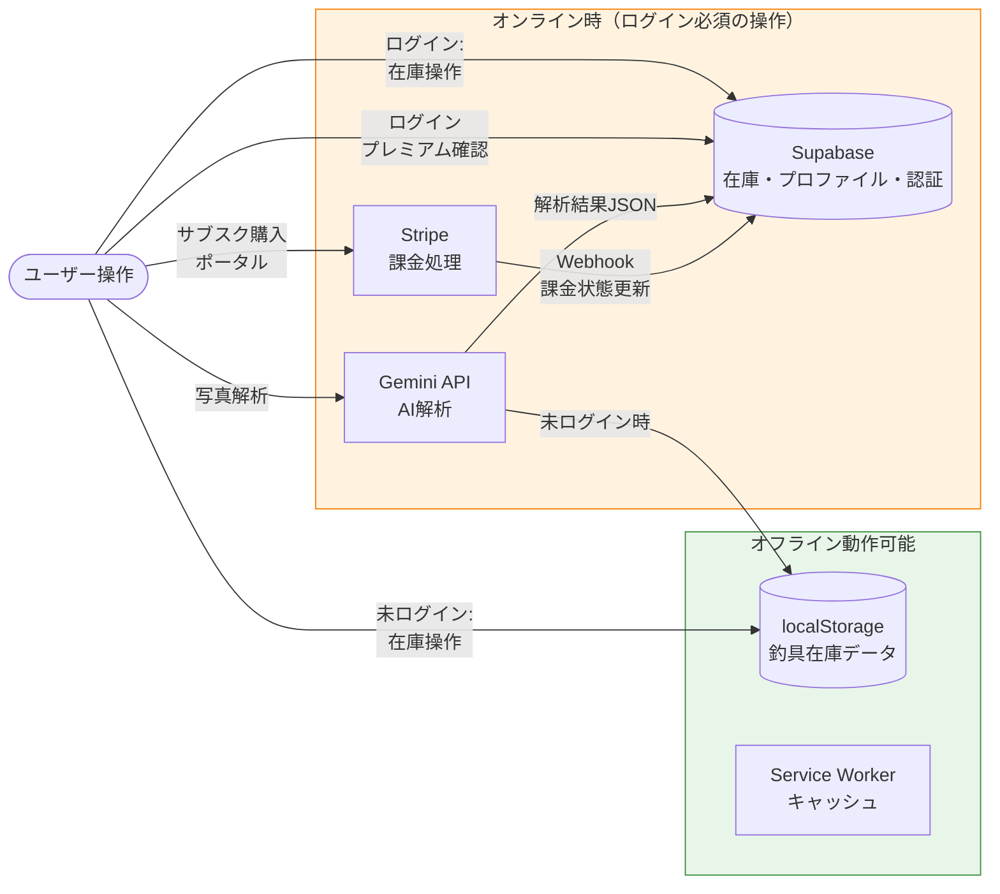
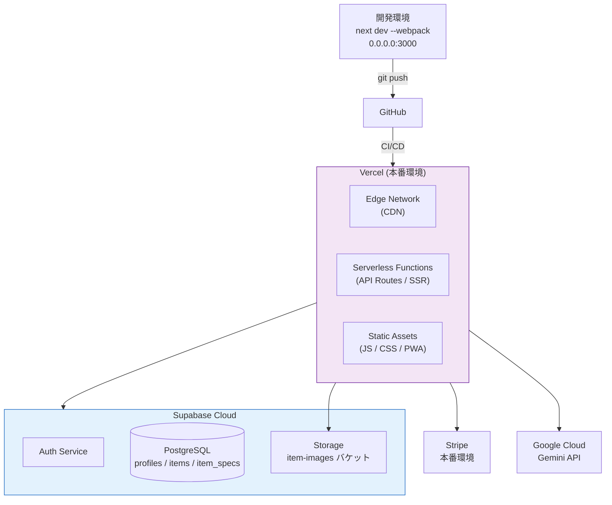

# 基本設計書：システム全体構造図（アーキテクチャ）

> **バージョン履歴**
> | バージョン | 日付 | 変更内容 |
> |---|---|---|
> | v1.0 | 2025年初版 | Expo (React Native) 版 |
> | v2.0 | 2026年6月 | Next.js PWA 版へ全面更新 |
> | v2.1 | 2026年6月 | Supabase 在庫保存・サーバー API 経由 DB・楽観的 UI |

---

## 1. アーキテクチャ概要

本アプリは **Next.js 16 (App Router)** を基盤とする PWA であり、未ログイン時は「ローカルファースト」、ログイン時は Supabase クラウド保存のハイブリッドデータ戦略を採用する。

| レイヤー | 役割 | 技術 |
|---|---|---|
| **プレゼンテーション層** | UI・ルーティング | Next.js App Router / React 19 / Tailwind CSS v4 |
| **データ層（ローカル）** | 未ログイン時の在庫永続化 | ブラウザ localStorage |
| **データ層（クラウド）** | ログイン時の在庫・認証・課金 | Supabase (PostgreSQL + Storage) |
| **API ファサード** | ストレージ切り替え・認証キャッシュ | `src/lib/db/index.ts` → サーバー API |
| **API層** | サーバーサイド処理 | Next.js API Routes (Route Handlers) |
| **外部サービス** | AI解析・課金・認証・デプロイ | Google Gemini / Stripe / Supabase Auth / Vercel |
| **オフライン対応** | キャッシュ・PWA化 | Service Worker (Workbox via @ducanh2912/next-pwa) |

---

## 2. コンポーネント構成図

```mermaid
graph TD
    subgraph Client ["クライアント (ブラウザ / PWA)"]
        direction TB
        subgraph UI ["UI レイヤー (Next.js App Router)"]
            P_Home["/ ホーム画面\n(在庫/買い物/写真/マイページ タブ)"]
            P_Login["/login ログイン画面"]
            P_Success["/success 決済完了画面"]
        end

        subgraph Logic ["ビジネスロジック層"]
            L_DB["src/lib/db/\nファサード + API クライアント"]
            L_Hook["useOptimisticQuantity\n楽観的 UI 更新"]
            L_AI["src/lib/ai.ts\nAI解析クライアント"]
            L_Auth["src/lib/supabase/\n認証クライアント群"]
        end

        subgraph Storage ["ローカルストレージ"]
            LS_Items[("localStorage\nfishing_gear_items\nfishing_gear_specs\nfishing_gear_status")]
        end

        subgraph SW ["Service Worker (Workbox)"]
            Cache["静的アセット\nキャッシュ"]
        end
    end

    subgraph Server ["サーバー (Vercel / Next.js)"]
        direction TB
        subgraph Middleware ["Next.js Middleware"]
            MW["src/middleware.ts\nセッション更新・\nルートガード"]
        end

        subgraph API ["API Routes (Route Handlers)"]
            R_Items["/api/items/*\n在庫 CRUD・数量変更"]
            R_Bootstrap["GET /api/inventory/bootstrap\n一括取得"]
            R_Analyze["POST /api/analyze\nGemini画像解析"]
            R_Checkout["POST /api/checkout\nStripe Checkout"]
            R_Portal["POST /api/portal\nStripe Portal"]
            R_Webhook["POST /api/webhook\nStripe Webhook"]
            R_Profile["GET /api/profile\nプロファイル取得"]
            R_AuthUser["GET /api/auth/user\nユーザー確認"]
            R_Version["GET /api/version\nバージョン情報"]
        end

        subgraph AuthCB ["認証コールバック"]
            R_Callback["/auth/callback\nOAuth/OTP コード交換"]
        end
    end

    subgraph External ["外部サービス"]
        Supabase_Auth["Supabase Auth\n(Magic Link / Google OAuth)"]
        Supabase_DB[("Supabase DB\nprofiles / items / item_specs")]
        Supabase_Storage["Supabase Storage\nitem-images バケット"]
        Stripe_API["Stripe API\nサブスクリプション管理"]
        Gemini["Google Gemini API\n画像解析 AI"]
        Vercel_Deploy["Vercel\nCDN / Edge Network"]
    end

    P_Home <--> L_DB
    P_Home --> L_AI
    P_Home --> L_Auth
    P_Login --> L_Auth
    L_DB -->|"未ログイン"| LS_Items
    L_DB -->|"ログイン時 fetch"| R_Items
    L_DB --> R_Bootstrap
    L_Hook --> L_DB
    L_AI --> R_Analyze
    L_Auth --> R_AuthUser
    L_Auth --> Supabase_Auth
    P_Home --> R_Checkout
    P_Home --> R_Portal
    P_Home --> R_Profile

    R_Items --> Supabase_DB
    R_Bootstrap --> Supabase_DB
    R_Analyze --> Gemini
    R_Checkout --> Stripe_API
    R_Portal --> Stripe_API
    R_Webhook --> Supabase_DB
    R_Items --> Supabase_Storage
    Stripe_API -- "Webhook" --> R_Webhook
    R_Profile --> Supabase_DB
    R_AuthUser --> Supabase_Auth
    R_Callback --> Supabase_Auth

    MW --> Supabase_Auth
    SW --> Cache

    style Client fill:#e3f2fd,stroke:#1565c0,stroke-width:2px
    style Server fill:#f3e5f5,stroke:#6a1b9a,stroke-width:2px
    style External fill:#fff3e0,stroke:#e65100,stroke-width:2px
    style Storage fill:#e8f5e9,stroke:#2e7d32,stroke-width:1px
    style SW fill:#fce4ec,stroke:#880e4f,stroke-width:1px
```

---

## 3. データフロー図（ハイブリッド永続化戦略）

---

## 4. デプロイ構成図

---

## 5. レイヤー責務一覧

| レイヤー | ファイル / モジュール | 責務 |
|---|---|---|
| **ページ** | `src/app/page.tsx` | メインSPA（在庫/買い物/写真/マイページ タブ） |
| **ページ** | `src/app/login/page.tsx` | 認証UI（Magic Link / Google OAuth） |
| **ページ** | `src/app/success/page.tsx` | Stripe 決済成功後のコールバック画面 |
| **Middleware** | `src/middleware.ts` | 全リクエストでセッション更新・認証リダイレクト処理 |
| **API Route** | `/api/analyze` | Gemini API 呼び出し・釣具情報JSON返却 |
| **API Route** | `/api/checkout` | Stripe Checkout Session 作成 |
| **API Route** | `/api/portal` | Stripe Customer Portal Session 作成 |
| **API Route** | `/api/webhook` | Stripe Webhook 受信・Supabase profiles 更新 |
| **API Route** | `/api/profile` | ログインユーザーの profiles データ返却 |
| **API Route** | `/api/auth/user` | 現在のログインユーザー情報返却 |
| **API Route** | `/api/auth/signout` | Supabase セッション破棄 |
| **API Route** | `/api/items/*` | 在庫 CRUD・数量変更（Cookie セッション経由） |
| **API Route** | `/api/inventory/bootstrap` | 在庫一覧 + 利用状況の一括取得 |
| **API Route** | `/api/app-status` | AI 利用回数の取得・更新 |
| **API Route** | `/api/version` | アプリバージョン・ビルド ID |
| **Auth Callback** | `/auth/callback` | OAuth/OTP コードをセッションに交換 |
| **ライブラリ** | `src/lib/db/index.ts` | ストレージ切り替えファサード（local / API） |
| **ライブラリ** | `src/lib/db/supabase-server.ts` | サーバー側 Supabase CRUD |
| **ライブラリ** | `src/lib/db/supabase-api.ts` | クライアント → API Route 呼び出し |
| **フック** | `src/hooks/useOptimisticQuantity.ts` | 数量変更の楽観的 UI + デバウンス同期 |
| **ライブラリ** | `src/lib/ai.ts` | `/api/analyze` クライアントラッパー（フォールバック付き） |
| **ライブラリ** | `src/lib/stripe.ts` | Stripe SDK インスタンス（サーバー専用） |
| **ライブラリ** | `src/lib/supabase/*` | Supabase クライアント（ブラウザ用/サーバー用/Admin用） |
| **コンポーネント** | `src/components/AppVersionBadge.tsx` | 画面右下固定のバージョン表示 |
| **コンポーネント** | `src/components/auth/*` | 認証状態表示・ログインフォーム |
| **定数** | `src/constants/appMeta.ts` | アプリバージョン・ビルド ID |
| **ユーティリティ** | `src/lib/haptic.ts` | タップ・長押し時の触覚フィードバック |
| **ユーティリティ** | `src/utils/itemForm.ts` | フォーム値↔DB値 変換・バリデーション |
| **定数** | `src/constants/categories.ts` | カテゴリ定義（大/中カテゴリ・色クラス） |
| **型定義** | `src/types/item.ts` | 釣具アイテム型定義 |
| **型定義** | `src/types/profile.ts` | ユーザープロファイル型定義 |
