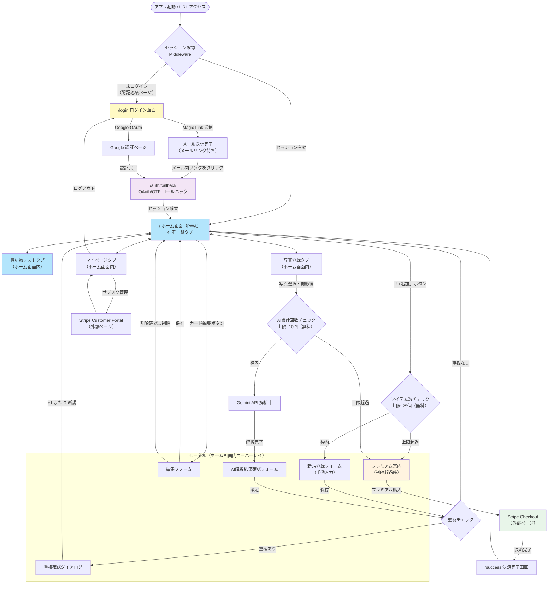
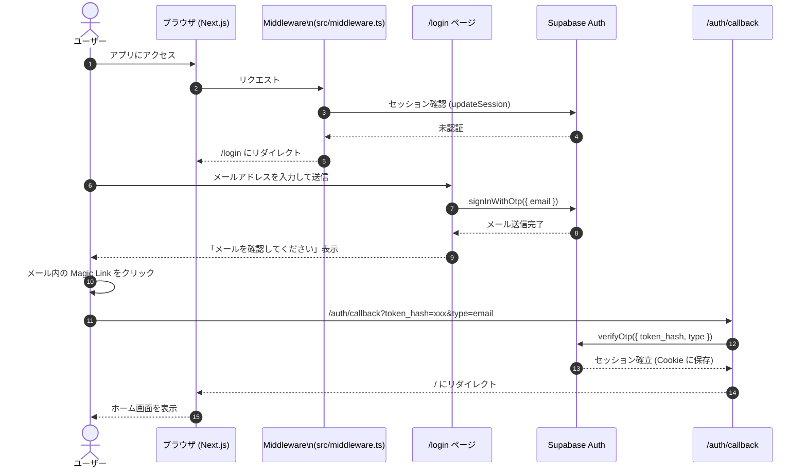
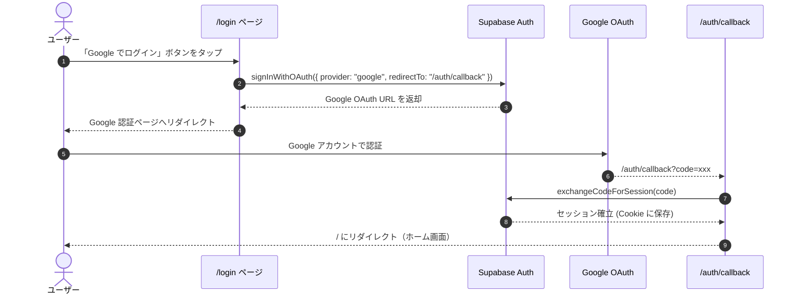
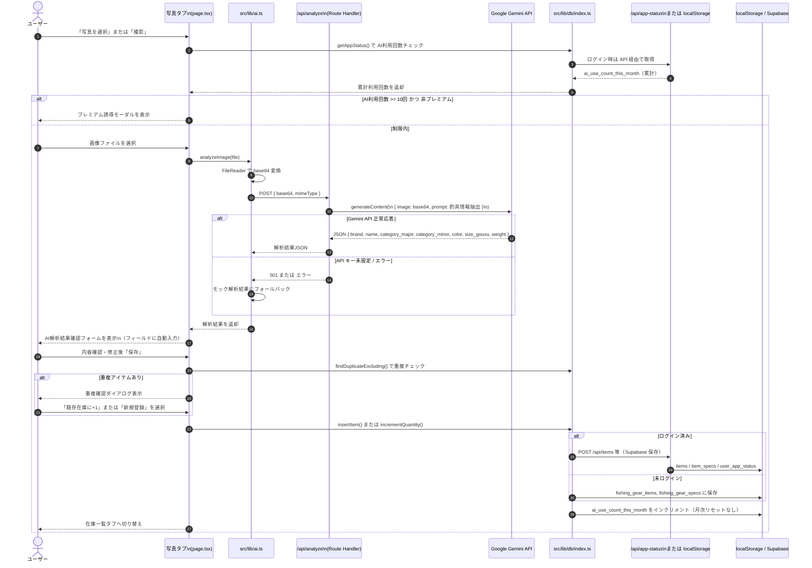
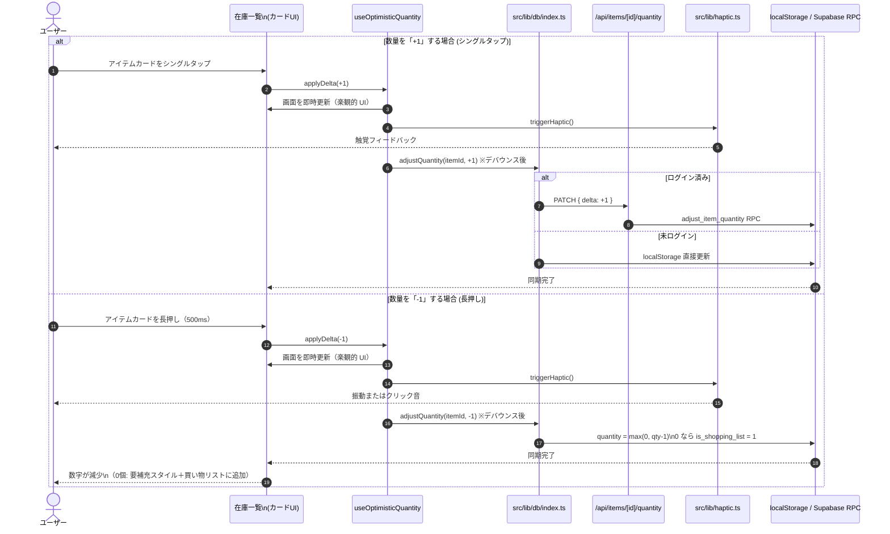
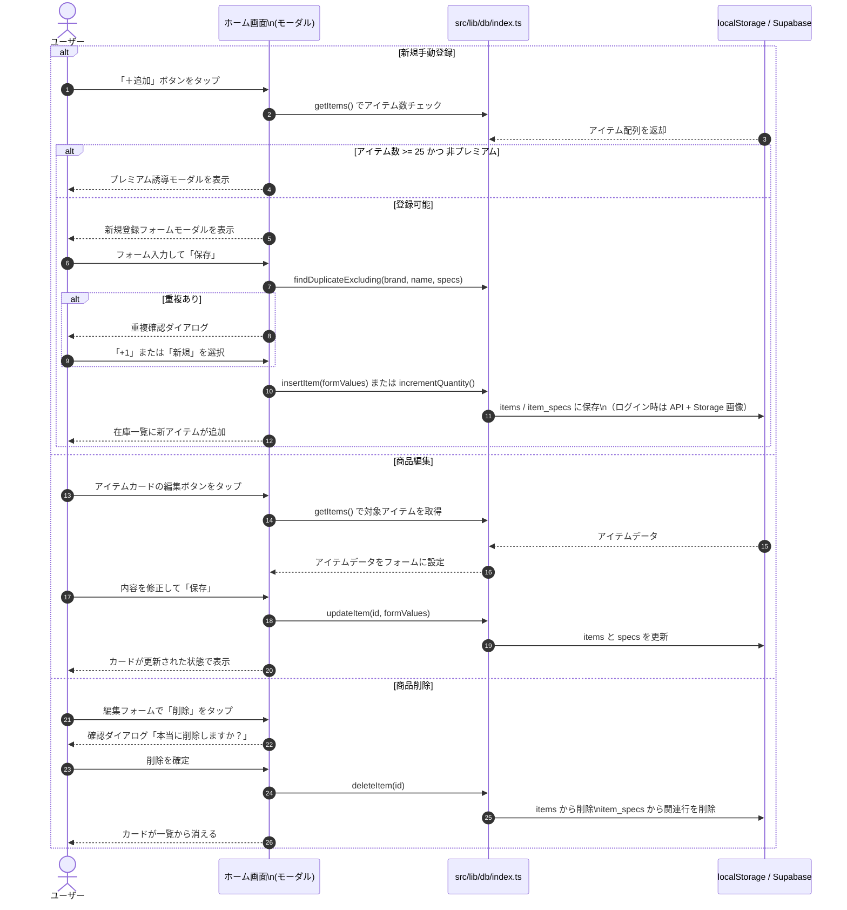
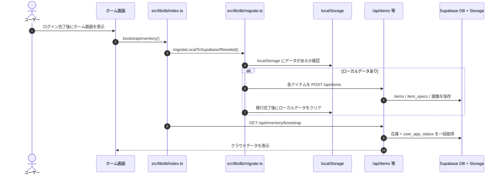
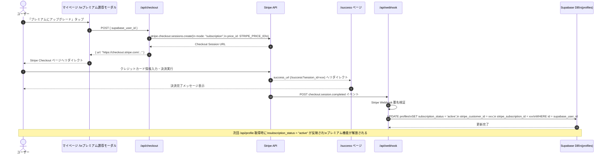
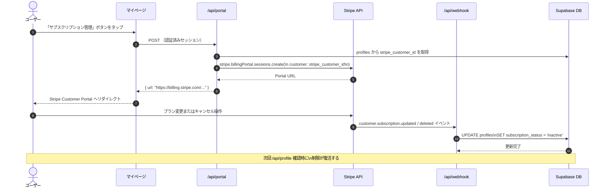

# 基本設計書：画面遷移図 ＆ 処理シーケンス図

> **バージョン履歴**
> | バージョン | 日付 | 変更内容 |
> |---|---|---|
> | v1.0 | 2025年初版 | Expo (React Native) 版 |
> | v2.0 | 2026年6月 | Next.js PWA 版へ全面更新（認証・Stripe フロー追加） |
> | v2.1 | 2026年6月 | Supabase 在庫保存・楽観的 UI・制限値更新（25個/累計10回AI） |

---

## 1. 画面遷移図（UIフロー）

---

## 2. 認証フロー（Supabase Auth）

### 2-1. Magic Link 認証シーケンス

### 2-2. Google OAuth 認証シーケンス

---

## 3. 写真撮影からAI解析・保存までのシーケンス

---

## 4. 数量変更（タップ・長押し）シーケンス

---

## 5. 手動登録・編集シーケンス

---

## 8. 初回ログイン時の localStorage → Supabase 移行シーケンス

---

## 6. Stripe 課金フロー（プレミアムプラン購入）

---

## 7. Stripe サブスクリプション管理（キャンセル・変更）

