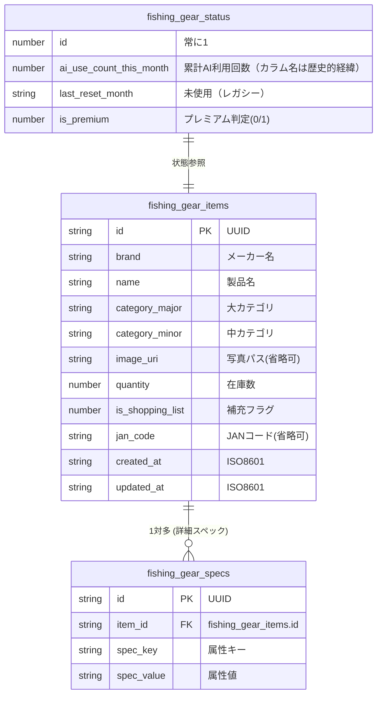

# 基本設計書：データストア詳細スキーマ設計

> **バージョン履歴**
> | バージョン | 日付 | 変更内容 |
> |---|---|---|
> | v1.0 | 2025年初版 | expo-sqlite によるローカルDB設計 |
> | v2.0 | 2026年6月 | localStorage（釣具在庫）＋ Supabase PostgreSQL（認証・課金）の二層構造に更新 |
> | v2.1 | 2026年6月 | ログイン時は Supabase に在庫保存（items/item_specs/user_app_status/Storage） |
> | v2.2 | 2026年6月 | カテゴリ再編：LURE/HOOK/SINKER/RIG/LINE/HARDWARE の6分類に変更（OTHER廃止、SINKER・HARDWARE新設） |
> | v2.3 | 2026年6月 | SINKER 中カテゴリ TEXAS（テキサスシンカー）を TAIRABA（タイラバシンカー）に変更 |
> | v2.4 | 2026年6月 | FLOAT 大カテゴリ追加（6分類→7分類）。中カテゴリ: FLOAT_ISO / FLOAT_NAGE / KAGO / FLOAT_OTHER |

---

## 1. データストア概要

PWA 版では、**ログイン状態に応じて**データストアを切り替えるハイブリッド構成を採用する。

| ストア | 技術 | 用途 | 利用条件 |
|---|---|---|---|
| **localStorage** | ブラウザ localStorage | 釣具在庫・スペック・AIステータス | 未ログイン時（オフライン可） |
| **Supabase PostgreSQL** | クラウドDB (PostgreSQL) | 在庫・スペック・AIステータス・プロファイル・課金 | ログイン時（オンライン必須） |
| **Supabase Storage** | オブジェクトストレージ | 商品画像（`item-images` バケット） | ログイン時 |

切り替えは `src/lib/db/index.ts` のファサードが担当する。ログイン後の初回アクセス時に `src/lib/db/migrate.ts` が localStorage のデータを Supabase へ自動移行する。

---

## 2. localStorage スキーマ

### 2-1. ER図（概念）



### 2-2. localStorage キー一覧

| キー | 型 | 説明 |
|---|---|---|
| `fishing_gear_items` | `Item[]` (JSON) | 釣具在庫アイテム一覧 |
| `fishing_gear_specs` | `ItemSpec[]` (JSON) | アイテム別スペック一覧 |
| `fishing_gear_status` | `AppStatus` (JSON) | AIカウンタ・プレミアム状態 |

---

### 2-3. `fishing_gear_items` テーブル（アイテム一覧）

```typescript
// src/types/item.ts
interface Item {
  id: string;           // UUID (createId() で生成)
  brand: string;        // メーカー名 (例: シマノ)
  name: string;         // 製品名 (例: サイレントアサシン 99F)
  category_major: string; // 大カテゴリ (LURE / RIG / HOOK / LINE / OTHER)
  category_minor: string; // 中カテゴリ (MINNOW / JIG / SNAP 等)
  image_uri: string;    // 画像の Data URI または URL (省略可)
  quantity: number;     // 現在庫数 (最小値: 0)
  is_shopping_list: number; // 補充フラグ (0: 通常, 1: 買い物リスト対象)
  jan_code: string;     // JANコード (省略可)
  created_at: string;   // ISO8601 形式 (例: 2026-06-01T10:00:00.000Z)
  updated_at: string;   // ISO8601 形式
}
```

| フィールド | 型 | 必須 | 説明 |
|---|---|---|---|
| `id` | string | ✅ | UUID（`crypto.randomUUID()` またはカスタム） |
| `brand` | string | ✅ | メーカー名（例: シマノ、ダイワ） |
| `name` | string | ✅ | 製品名（例: サイレントアサシン 99F） |
| `category_major` | string | ✅ | 大カテゴリ（`LURE` / `HOOK` / `SINKER` / `RIG` / `LINE` / `HARDWARE` / `FLOAT`） |
| `category_minor` | string | ✅ | 中カテゴリ（PLUG / JIG_HEAD / GAN_DAMA / SABIKI / PE / SNAP 等） |
| `image_uri` | string | - | 画像 Data URI またはファイルパス |
| `quantity` | number | ✅ | 在庫数（デフォルト: 1、最小: 0） |
| `is_shopping_list` | number | ✅ | 補充フラグ（0 = 通常、1 = 買い物リスト対象） |
| `jan_code` | string | - | JANコード（将来的なバーコードスキャン用） |
| `created_at` | string | ✅ | 登録日時（ISO8601） |
| `updated_at` | string | ✅ | 最終更新日時（ISO8601） |

**自動更新ルール:**
- `quantity === 0` になった場合: `is_shopping_list = 1` に自動設定
- `quantity > 0` にカウントアップされた場合: `is_shopping_list = 0` に自動リセット

---

### 2-4. `fishing_gear_specs` テーブル（スペック詳細）

```typescript
interface ItemSpec {
  id: string;       // UUID
  item_id: string;  // fishing_gear_items.id への参照
  spec_key: string; // 属性キー (color / weight / size_gousu 等)
  spec_value: string; // 属性値 (チャートゴールド / 14g / 10号 等)
}
```

| フィールド | 型 | 必須 | 説明 |
|---|---|---|---|
| `id` | string | ✅ | UUID |
| `item_id` | string | ✅ | 親アイテムの id（削除時は関連行も削除） |
| `spec_key` | string | ✅ | 属性キー（`color` / `weight` / `size_gousu` / `hook_size` 等） |
| `spec_value` | string | ✅ | 属性値（例: `チャートゴールド`, `14g`, `10号`） |

**既知の spec_key 一覧:**

| spec_key | 意味 | 例 |
|---|---|---|
| `color` | カラー・カラーパターン | チャートゴールド |
| `weight` | 重量 | 14g |
| `size_gousu` | サイズ（号数） | 10号 |
| `hook_size` | フックサイズ | #6 |
| `line_strength` | ライン強度 | 3lb |
| `length` | 長さ | 99mm |

---

### 2-5. `fishing_gear_status` テーブル（アプリ状態）

```typescript
interface AppStatus {
  id: 1;                        // 常に 1 固定（シングルトン）
  ai_use_count_this_month: number; // 累計 AI 解析実行回数（月次リセットなし）
  last_reset_month: string;     // レガシー（現行ロジックでは未使用）
  is_premium: number;           // プレミアムフラグ (0/1) ※現行UI未使用
}
```

| フィールド | 型 | 説明 |
|---|---|---|
| `id` | number | 常に `1`（シングルトン） |
| `ai_use_count_this_month` | number | **累計** AI 解析実行回数（無料上限: 10回、月次リセットなし） |
| `last_reset_month` | string | レガシーカラム（現行ロジックでは参照しない） |
| `is_premium` | number | プレミアムフラグ（現行は `profiles.subscription_status` を参照） |

**AI 利用回数ロジック（`src/lib/db/local.ts` / `supabase-server.ts`）:**
- `incrementAiUseCount()` 呼び出し時に `ai_use_count_this_month` を +1（リセット処理なし）
- 無料プラン上限: **累計10回**（`FREE_AI_LIMIT = 10`）
- プレミアム（`subscription_status === "active"`）は無制限

---

## 3. Supabase PostgreSQL スキーマ

### 3-1. ER図

```mermaid
erDiagram
    auth_users ||--o| profiles : "1対1"
    auth_users ||--o{ items : "1対多"
    items ||--o{ item_specs : "1対多"
    auth_users ||--o| user_app_status : "1対1"

    auth_users {
        uuid id PK "Supabase Auth 管理"
        string email
        timestamptz created_at
    }

    profiles {
        uuid id PK_FK "auth.users.id を参照"
        string email "ユーザーメール"
        string stripe_customer_id "Stripe Customer ID (unique)"
        string stripe_subscription_id "Stripe Subscription ID"
        string subscription_status "active / inactive"
        timestamptz created_at
        timestamptz updated_at
    }

    items {
        uuid id PK
        uuid user_id FK
        string brand
        string name
        string category_major
        string category_minor
        string image_uri
        integer quantity
        integer is_shopping_list
        string jan_code
        timestamptz created_at
        timestamptz updated_at
    }

    item_specs {
        uuid id PK
        uuid user_id FK
        uuid item_id FK
        string spec_key
        string spec_value
    }

    user_app_status {
        uuid user_id PK_FK
        integer ai_use_count_this_month "累計AI利用回数"
        string last_reset_month "レガシー"
    }
```

### 3-2. `profiles` テーブル定義

マイグレーションファイル: `supabase/migrations/001_profiles.sql`

```sql
CREATE TABLE public.profiles (
  id                    UUID        PRIMARY KEY
                                    REFERENCES auth.users(id) ON DELETE CASCADE,
  email                 TEXT,
  stripe_customer_id    TEXT        UNIQUE,
  stripe_subscription_id TEXT,
  subscription_status   TEXT        NOT NULL DEFAULT 'inactive'
                                    CHECK (subscription_status IN ('active', 'inactive')),
  created_at            TIMESTAMPTZ NOT NULL DEFAULT NOW(),
  updated_at            TIMESTAMPTZ NOT NULL DEFAULT NOW()
);
```

| カラム名 | 型 | 制約 | 説明 |
|---|---|---|---|
| `id` | UUID | PRIMARY KEY, FK → auth.users.id | Supabase Auth のユーザー ID と同一 |
| `email` | TEXT | - | ユーザーのメールアドレス |
| `stripe_customer_id` | TEXT | UNIQUE | Stripe の Customer ID（`cus_xxx`） |
| `stripe_subscription_id` | TEXT | - | Stripe の Subscription ID（`sub_xxx`） |
| `subscription_status` | TEXT | NOT NULL, CHECK | `"active"` または `"inactive"` |
| `created_at` | TIMESTAMPTZ | NOT NULL DEFAULT NOW() | レコード作成日時 |
| `updated_at` | TIMESTAMPTZ | NOT NULL DEFAULT NOW() | 最終更新日時 |

### 3-3. Row Level Security (RLS)

```sql
-- 有効化
ALTER TABLE public.profiles ENABLE ROW LEVEL SECURITY;

-- 自分のプロファイルのみ SELECT 可
CREATE POLICY "Users can view own profile"
  ON public.profiles
  FOR SELECT
  USING (auth.uid() = id);
```

### 3-4. 新規ユーザー自動登録トリガー

```sql
-- 新規 Auth ユーザー作成時に profiles 行を自動挿入
CREATE OR REPLACE FUNCTION public.handle_new_user()
RETURNS TRIGGER AS $$
BEGIN
  INSERT INTO public.profiles (id, email)
  VALUES (NEW.id, NEW.email);
  RETURN NEW;
END;
$$ LANGUAGE plpgsql SECURITY DEFINER;

CREATE TRIGGER on_auth_user_created
  AFTER INSERT ON auth.users
  FOR EACH ROW EXECUTE FUNCTION public.handle_new_user();
```

### 3-5. `items` / `item_specs` / `user_app_status` テーブル定義

マイグレーションファイル: `supabase/migrations/002_inventory.sql`

| テーブル | 説明 |
|---|---|
| `items` | ユーザー単位の釣具在庫（`user_id` で RLS 分離） |
| `item_specs` | アイテム別スペック（`item_id` + `spec_key` でユニーク） |
| `user_app_status` | ユーザー単位の AI 累計利用回数 |

**Storage バケット:** `item-images`（公開読み取り、認証ユーザーのみ自分のフォルダに書き込み可）

**RLS ポリシー:** 各テーブルで `auth.uid() = user_id` のみ CRUD 可

### 3-6. 数量変更 RPC

マイグレーションファイル: `supabase/migrations/003_quantity_delta.sql`

```sql
-- adjust_item_quantity(item_id, user_id, delta)
-- quantity を delta 分更新し、0 になったら is_shopping_list = 1 に自動設定
```

`/api/items/[id]/quantity` の PATCH リクエストから呼び出され、連続タップ時の DB 負荷を軽減する。

---

## 4. カテゴリ定義（`src/constants/categories.ts`）

> v2.4 カテゴリ拡張：FLOAT（ウキ・カゴ）を新設、7大分類に拡張。

### 大カテゴリ

| 値 | 画面ラベル | 説明 |
|---|---|---|
| `LURE` | ルアー \| ワーム | プラグ・メタルジグ・エギ・ワーム・タイラバ等 |
| `HOOK` | フック \| ジグヘッド | バラ針・トリプルフック・ジグヘッド・アシストフック |
| `SINKER` | シンカー \| オモリ | ガン玉・ナス型・タイラバシンカー・タングステン等 |
| `RIG` | 完成仕掛け | サビキ・船釣り胴付き・投げ釣り・タコ仕掛け等 |
| `LINE` | ライン \| 糸 | PEライン・フロロカーボンリーダー・ナイロン道糸 |
| `HARDWARE` | 接続金具 \| 小物 | スナップ・スイベル・スプリットリング・クッションゴム |
| `FLOAT` | ウキ \| カゴ | 円錐ウキ・棒ウキ・投げウキ・コマセカゴ・サビキカゴ等 |

### 中カテゴリ（大カテゴリ別）

| 大カテゴリ | 中カテゴリ値 | ラベル |
|---|---|---|
| LURE | PLUG | プラグ |
| LURE | JIG | メタルジグ |
| LURE | EGI | エギ |
| LURE | WORM | ワーム |
| LURE | TAIRA | タイラバ |
| LURE | OTHER | その他 |
| HOOK | SINGLE | バラ針 |
| HOOK | TREBLE | トリプルフック |
| HOOK | JIG_HEAD | ジグヘッド |
| HOOK | ASSIST | アシストフック |
| HOOK | OTHER | その他 |
| SINKER | GAN_DAMA | ガン玉 |
| SINKER | NASU | ナス型オモリ |
| SINKER | TAIRABA | タイラバシンカー |
| SINKER | TUNGSTEN | タングステン |
| SINKER | OTHER | その他 |
| RIG | SABIKI | サビキ仕掛け |
| RIG | FUNA_DOU | 船釣り胴付き |
| RIG | NAGE | 投げ釣り仕掛け |
| RIG | TAKO | タコ仕掛け |
| RIG | OTHER | その他 |
| LINE | PE | PEライン |
| LINE | FLUORO | フロロカーボン |
| LINE | NYLON | ナイロン道糸 |
| LINE | OTHER | その他 |
| HARDWARE | SNAP | スナップ |
| HARDWARE | SWIVEL | スイベル |
| HARDWARE | SPLIT_RING | スプリットリング |
| HARDWARE | CUSHION | クッションゴム |
| HARDWARE | OTHER | その他 |
| FLOAT | FLOAT_ISO | 円錐ウキ / 棒ウキ |
| FLOAT | FLOAT_NAGE | 投げウキ / 遠投ウキ |
| FLOAT | KAGO | コマセカゴ / サビキカゴ |
| FLOAT | FLOAT_OTHER | その他 |