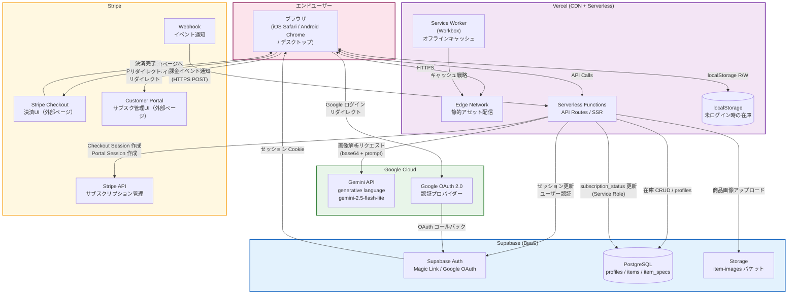
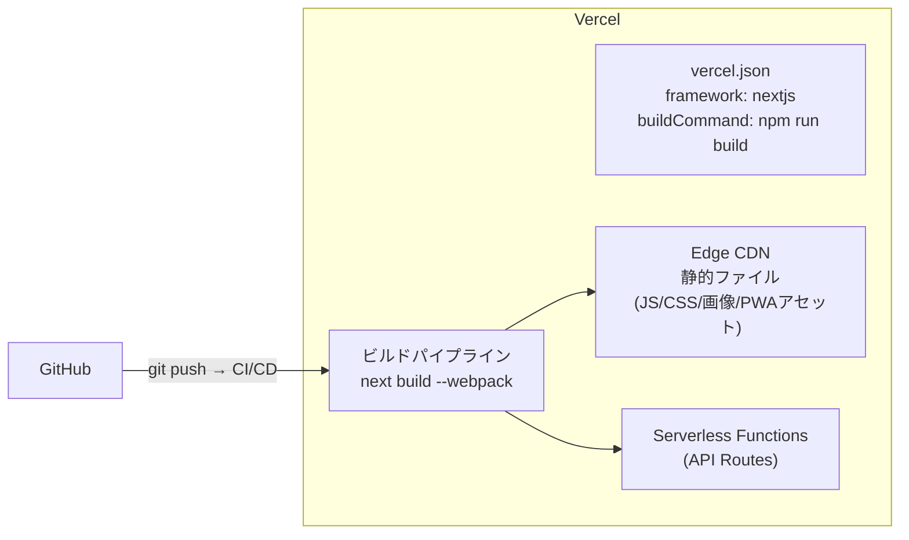
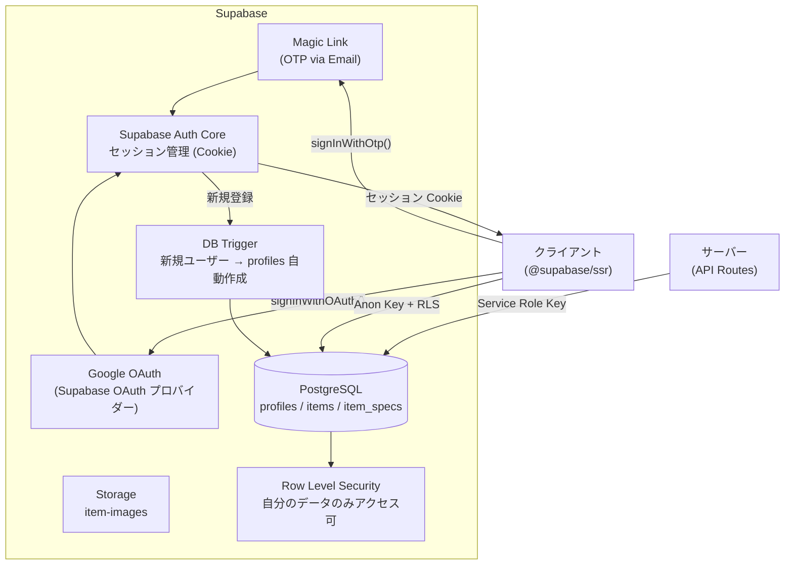
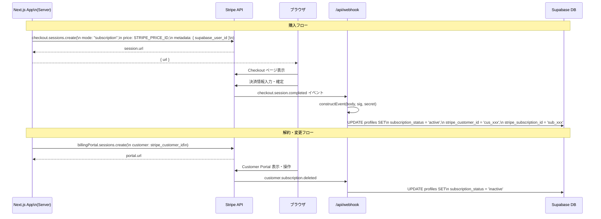
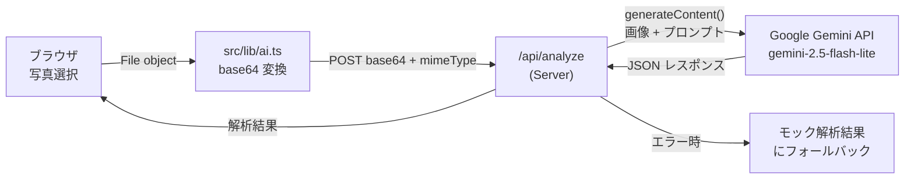
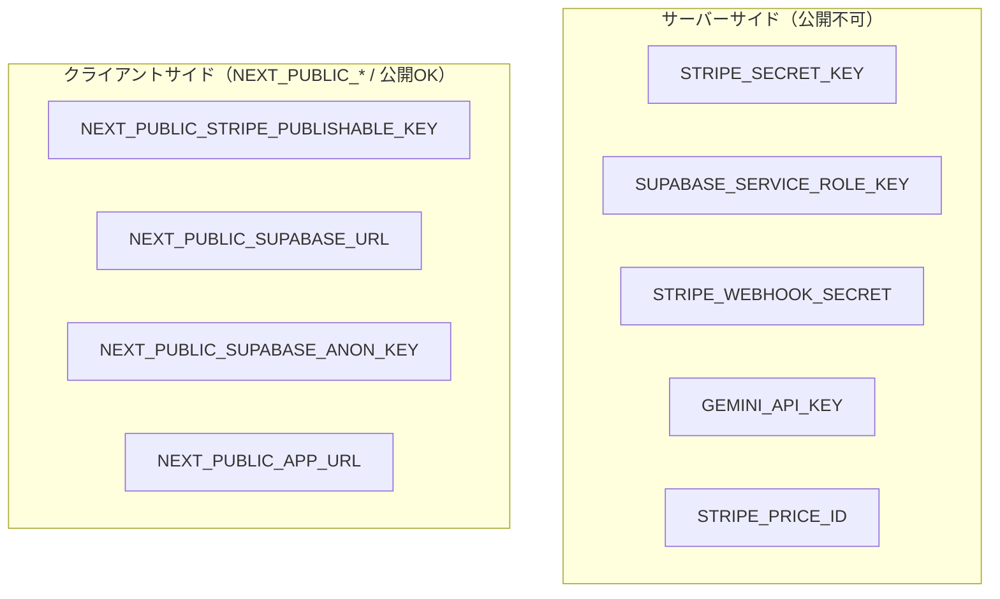

# サービスアーキテクチャ設計書：外部サービス連携

> **作成日**: 2026年6月  
> **対象バージョン**: Next.js PWA 版 (v2.1)  
> **アプリバージョン**: 1.1.5

---

## 1. 利用サービス一覧

| サービス | 種別 | 用途 | 課金モデル |
|---|---|---|---|
| **Vercel** | PaaS (デプロイ) | アプリホスティング・Serverless Functions・CDN | Hobby / Pro プラン |
| **Supabase** | BaaS | 認証（Auth）・在庫DB（PostgreSQL）・画像Storage | Free / Pro プラン |
| **Stripe** | 決済SaaS | サブスクリプション課金・Webhook | 従量課金（手数料） |
| **Google Gemini API** | AI/ML API | 釣具パッケージ画像の AI 解析 | 従量課金（トークン） |

---

## 2. サービス全体連携アーキテクチャ



---

## 3. サービス別詳細設計

### 3-1. Vercel（デプロイ・CDN）

**役割:** アプリケーション全体のホスティングと配信



**設定（`vercel.json`）:**

```json
{
  "framework": "nextjs",
  "buildCommand": "npm run build",
  "installCommand": "npm install"
}
```

**環境変数（Vercel プロジェクト設定で管理）:**
- `NEXT_PUBLIC_*`: ビルド時にクライアントバンドルに埋め込まれる
- その他: Serverless Functions 実行時のみ参照可能

---

### 3-2. Supabase（認証・データベース）

**役割:** ユーザー認証・在庫データ・課金ステータスの永続化



**Supabase クライアントの使い分け:**

| モジュール | ファイル | 用途 | 認証情報 |
|---|---|---|---|
| ブラウザ用クライアント | `src/lib/supabase/client.ts` | クライアントコンポーネントでの認証操作 | Anon Key |
| サーバー用クライアント | `src/lib/supabase/server.ts` | Server Components / Route Handlers | Anon Key + cookies |
| Middleware クライアント | `src/lib/supabase/middleware.ts` | セッション更新（全リクエスト） | Anon Key + cookies |
| Admin クライアント | `src/lib/supabase/admin.ts` | Webhook 経由の DB 直接更新 | Service Role Key |

**Supabase Auth フロー（Magic Link）:**

```
1. signInWithOtp({ email }) → Supabase がメール送信
2. ユーザーがリンクをクリック → /auth/callback?token_hash=xxx
3. verifyOtp({ token_hash, type: "email" }) → セッション確立
4. Cookie にセッショントークンを保存
5. Middleware が毎リクエストで updateSession() を実行
```

---

### 3-3. Stripe（サブスクリプション課金）

**役割:** プレミアムプランの月額課金管理



**Stripe 設定値:**

| 設定 | 環境変数 | 説明 |
|---|---|---|
| 秘密鍵 | `STRIPE_SECRET_KEY` | サーバーサイド API 呼び出し用 |
| 公開鍵 | `NEXT_PUBLIC_STRIPE_PUBLISHABLE_KEY` | フロントエンド用（現時点では直接使用なし） |
| Webhook シークレット | `STRIPE_WEBHOOK_SECRET` | Webhook 署名検証用 |
| Price ID | `STRIPE_PRICE_ID` | サブスクリプションの料金プラン ID |

**Webhook イベント処理:**

| イベント | 処理内容 |
|---|---|
| `checkout.session.completed` | `subscription_status = 'active'`、`stripe_customer_id`・`stripe_subscription_id` を保存 |
| `customer.subscription.updated` | `subscription_status` をイベントの `status` で更新 |
| `customer.subscription.deleted` | `subscription_status = 'inactive'` に更新 |

---

### 3-4. Google Gemini API（AI画像解析）

**役割:** 釣具パッケージ写真からメタデータを自動抽出



**Gemini API リクエスト構造:**

```
モデル: gemini-2.5-flash-lite（環境変数 GEMINI_MODEL で変更可）

エンドポイント:
  https://generativelanguage.googleapis.com/v1beta/models/{model}:generateContent

リクエスト:
  - inlineData: { mimeType, data: base64 }
  - text: 釣具情報抽出プロンプト（JSON形式で返却指示）

レスポンス JSON 構造:
  {
    "brand": "シマノ",
    "name": "サイレントアサシン 99F",
    "category_major": "LURE",
    "category_minor": "MINNOW",
    "color": "チャートバックパール",
    "size_gousu": null,
    "weight": "11g"
  }
```

**フォールバック動作:**
- `GEMINI_API_KEY` 未設定: `/api/analyze` が 501 を返す → クライアントがモックデータで代替
- API エラー（ネットワーク等）: エラーをキャッチしモックデータにフォールバック

---

## 4. セキュリティ設計

### 4-1. シークレット管理



### 4-2. 認可・アクセス制御

| 対象 | 制御方式 | 詳細 |
|---|---|---|
| Supabase profiles / items 等 | Row Level Security (RLS) | `auth.uid() = user_id`（または `id`）のみ CRUD 可 |
| 在庫 API Routes | Cookie セッション確認 | 未認証の場合 401 を返す |
| Storage item-images | フォルダ単位の RLS | `auth.uid()` とパスの先頭フォルダが一致する場合のみ書き込み可 |
| Stripe Webhook | 署名検証 | `stripe.webhooks.constructEvent()` で正当性確認 |
| Supabase 管理操作 | Service Role Key | Webhook 経由のみ使用（クライアント非公開） |

### 4-3. CORS・オリジン制御

```typescript
// next.config.ts
allowedDevOrigins: ["192.168.0.250", "localhost"]
// → LAN 内の実機テスト（スマートフォン）からのアクセスを許可
```

---

## 5. 環境構成

| 環境 | URL | 特徴 |
|---|---|---|
| **開発環境** | `http://localhost:3000` または `http://192.168.0.250:3000` | `next dev --webpack`, PWA 無効, DevOriginNormalizer が動作 |
| **本番環境** | `https://<your-app>.vercel.app` | `next build`, PWA 有効, Stripe 本番 |

### 開発時の特記事項

1. **`DevOriginNormalizer` コンポーネント**: 開発時に `0.0.0.0` で起動したアプリにアクセスした場合、`localhost` に自動リダイレクトする（Supabase OAuth のコールバック URL がホスト名に依存するため）
2. **PWA は開発時無効**: `@ducanh2912/next-pwa` は `NODE_ENV=development` 時に自動で無効化される
3. **Stripe Webhook のローカルテスト**: `stripe listen --forward-to localhost:3000/api/webhook` で Stripe CLI を使用

---

## 6. 拡張性と将来考慮事項

| 項目 | 現状 | 将来の拡張候補 |
|---|---|---|
| 釣具データの同期 | ✅ 実装済み（ログイン時 Supabase、未ログイン時 localStorage） | オフライン時の書き込みキュー・競合解決 |
| プッシュ通知 | 未実装 | Web Push API + Service Worker で在庫切れ通知 |
| バーコードスキャン | `jan_code` フィールドは用意済み | カメラ API + バーコードライブラリで JAN コード読み取り |
| 釣果ログ | 未実装 | items に紐づく `catch_logs` テーブルの追加 |
| 多言語対応 | 日本語のみ | `next-intl` 等での i18n 対応 |
| Analytics | 未実装 | Vercel Analytics または Google Analytics 連携 |
