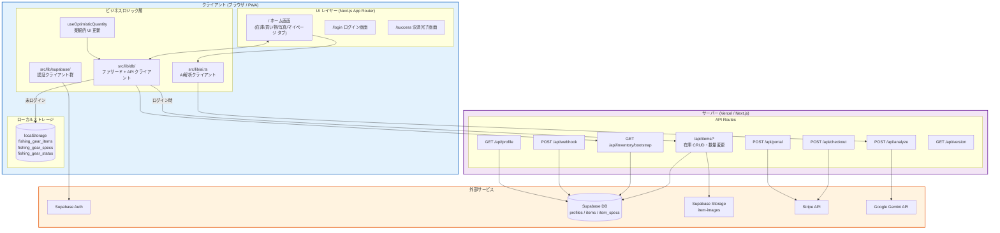
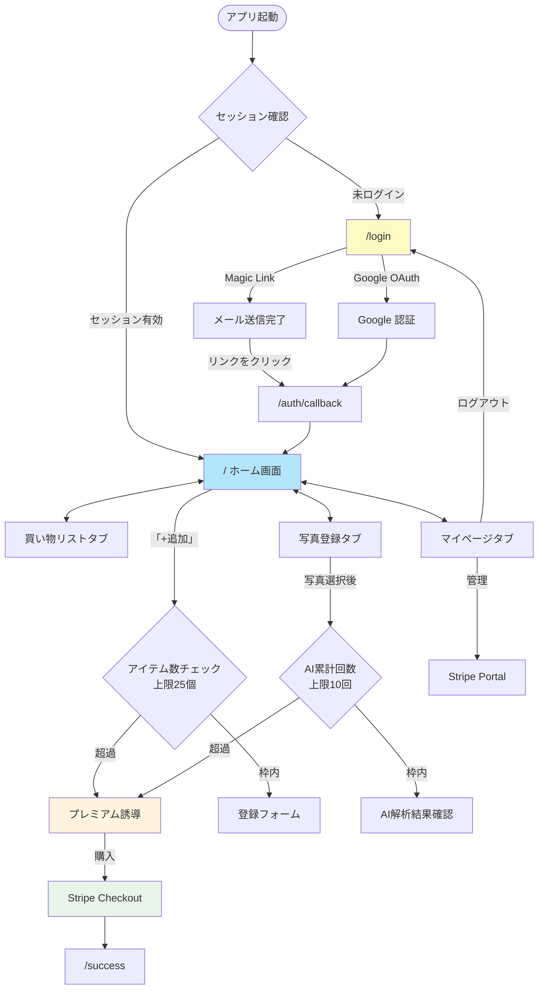
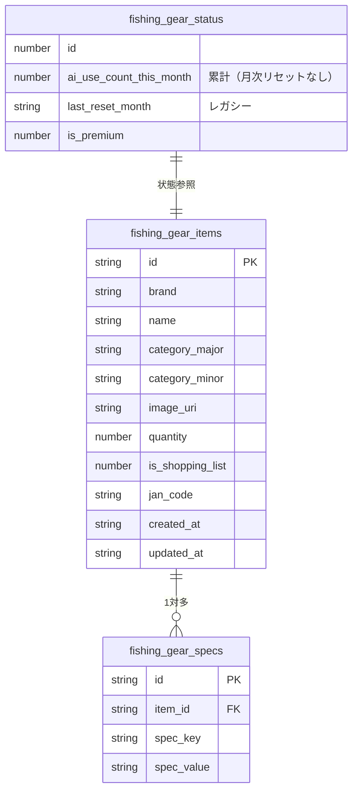
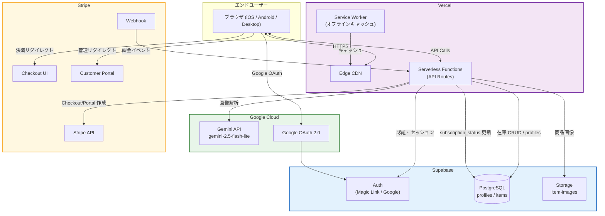

# My Fishing Gear 設計書 一式

> このドキュメントは個別設計書（`1_requirements.md` ～ `6_service_architecture.md`）の統合版です。
>
> **バージョン**: v2.2（Next.js PWA 版）  
> **アプリバージョン**: 1.1.5  
> **最終更新**: 2026年6月

---

# 目次

1. [要件定義書](#1-要件定義書)
2. [システムアーキテクチャ](#2-システムアーキテクチャ)
3. [画面遷移図・処理シーケンス図](#3-画面遷移図処理シーケンス図)
4. [データストアスキーマ設計](#4-データストアスキーマ設計)
5. [ディレクトリ構成](#5-ディレクトリ構成)
6. [サービスアーキテクチャ（外部サービス連携）](#6-サービスアーキテクチャ外部サービス連携)

---

# 1. 要件定義書

> 詳細: [`1_requirements.md`](./1_requirements.md)

## 1-0. ブランド・プロダクトコンセプト（Are-Attakke）

**Are-Attakke（あったっけ / 略称 AA）** は、消耗品の在庫を「ある？なかった？」と素早く確認するためのシリーズブランドである。店頭や作業現場での重複購入・欠品を防ぐことを目的とする。

| 順序 | シリーズ | アイコン中央文字 | 対象 | 状態 |
|---|---|---|---|---|
| **第1弾** | AA × **釣** | **釣** | 釣り消耗品（フック・シンカー・ルアー等） | **本アプリ** |
| 第2弾 | AA × 手芸 | 手芸 | 糸・ビーズ・生地等 | 構想 |
| 第3弾 | AA × 工務 | 工 | ネジ・ビス・建築資材等 | 構想 |
| 第4弾 | AA × プラモ | 模 | ランナー・パテ・塗料等 | 構想 |

- **アイコン**: AA マーク（2 つの「A」を円弧状に変形した向かい合うモチーフ）＋ 領域文字「釣」を中央に配置
- **アセット**: `public/fishing-gear-icon.svg`
- **本アプリ**: Are-Attakke シリーズ第1弾。アプリ名は当面「My Fishing Gear」を維持

## 1-1. システム概要

釣り人が所有する仕掛け・ルアー・小物の在庫をスマートフォン上で効率的に管理する **Progressive Web Application (PWA)**。Are-Attakke ブランド第1弾として、釣り消耗品の「あったっけ問題」を解消する。

| 項目 | 技術・サービス |
|---|---|
| フロントエンド | Next.js 16 (App Router) + React 19 + TypeScript |
| スタイリング | Tailwind CSS v4 |
| PWA | @ducanh2912/next-pwa（Service Worker + Web Manifest） |
| 在庫データ永続化 | 未ログイン: localStorage / ログイン: Supabase + Storage |
| 認証 | Supabase Auth（Magic Link / Google OAuth） |
| 課金 | Stripe（サブスクリプション） |
| AI解析 | Google Gemini API（gemini-2.5-flash-lite） |
| デプロイ | Vercel |

## 1-2. 主要機能要件

| # | 機能 | 概要 |
|---|---|---|
| F-1 | AI画像解析・登録 | Gemini API で写真から釣具情報を自動抽出 |
| F-2 | 在庫一覧・カテゴリ管理 | カード型UI でのタップ操作による在庫管理 |
| F-3 | ノンキーボード数量変更 | タップ(+1)・長押し(-1)の直感的操作 |
| F-4 | 買い物リスト | 在庫0またはフラグ立てアイテムの自動集約 |
| F-5 | 認証 | Magic Link / Google OAuth によるパスワードレス認証 |
| F-6 | Stripe 課金 | サブスクリプション購入・管理・Webhook 処理 |
| F-7 | クラウド保存 | ログイン時 Supabase 同期・初回ログイン時 localStorage 自動移行 |
| F-8 | バージョン表示 | 画面右下バッジ・マイページにアプリバージョン常時表示 |

## 1-3. 無料プランの制限

| 制限項目 | 上限値 |
|---|---|
| 登録アイテム数 | **25個** |
| AI 画像解析 | **累計10回**（月次リセットなし） |

プレミアム（`subscription_status === "active"`）は登録・AI解析とも無制限。

## 1-4. 非機能要件

- **ハイブリッド永続化**: 未ログイン時はオフラインで localStorage に保存。ログイン時は Supabase API 経由で同期
- **楽観的 UI**: 数量変更は画面を即時更新し、バックグラウンドでサーバーに同期（300ms デバウンス）
- **高速起動**: 3秒以内にコンテンツ表示（Service Worker キャッシュ活用）
- **片手操作性**: 主要操作の8割が親指1本で完結
- **クロスプラットフォーム**: iOS Safari / Android Chrome / デスクトップ対応

---

# 2. システムアーキテクチャ

> 詳細: [`2_architecture.md`](./2_architecture.md)

## 2-1. コンポーネント構成図



## 2-2. レイヤー責務一覧

| レイヤー | ファイル/モジュール | 責務 |
|---|---|---|
| ページ | `src/app/page.tsx` | メインSPA（4タブ） |
| ページ | `src/app/login/page.tsx` | 認証UI |
| Middleware | `src/middleware.ts` | セッション更新・ルートガード |
| API Route | `/api/analyze` | Gemini API 呼び出し |
| API Route | `/api/checkout` | Stripe Checkout Session 作成 |
| API Route | `/api/portal` | Stripe Portal Session 作成 |
| API Route | `/api/webhook` | Stripe Webhook 受信・DB更新 |
| API Route | `/api/items/*` | 在庫 CRUD・数量変更（Cookie セッション経由） |
| API Route | `/api/inventory/bootstrap` | 在庫 + appStatus 一括取得 |
| API Route | `/api/version` | アプリバージョン・ビルド ID |
| ライブラリ | `src/lib/db/index.ts` | ストレージ切り替えファサード |
| フック | `useOptimisticQuantity.ts` | 数量変更の楽観的 UI |
| ライブラリ | `src/lib/ai.ts` | AI解析クライアント |
| ライブラリ | `src/lib/supabase/*` | Supabase クライアント群 |

---

# 3. 画面遷移図・処理シーケンス図

> 詳細: [`3_sequence_and_flow.md`](./3_sequence_and_flow.md)

## 3-1. 画面遷移図



## 3-2. AI解析フロー（概要）

```
ユーザーが写真選択
  → lib/ai.ts で base64 変換
  → /api/analyze にPOST
  → Gemini API で解析
  → JSON（brand/name/category等）を返却
  → フォームに自動入力
  → 重複チェック後保存（未ログイン: localStorage / ログイン: Supabase）
```

## 3-4. 数量変更フロー（概要）

```
タップ/長押し
  → useOptimisticQuantity で画面を即時更新
  → 300ms デバウンス後に adjustQuantity()
  → ログイン時: PATCH /api/items/[id]/quantity（adjust_item_quantity RPC）
  → 未ログイン時: localStorage 直接更新
```

## 3-3. Stripe 課金フロー（概要）

```
「プレミアム購入」タップ
  → /api/checkout でStripe Checkout Session作成
  → Stripe 決済ページへリダイレクト
  → 決済完了 → /success
  → Stripe Webhook → /api/webhook
  → Supabase profiles.subscription_status = "active"
```

---

# 4. データストアスキーマ設計

> 詳細: [`4_db_schema.md`](./4_db_schema.md)

## 4-1. データストア概要

| ストア | 技術 | 用途 | オフライン対応 |
|---|---|---|---|
| **localStorage** | ブラウザ localStorage | 釣具在庫・スペック・AIステータス | 未ログイン時（オフライン可） |
| **Supabase PostgreSQL** | クラウドDB | 在庫・スペック・AIステータス・プロファイル・課金 | ログイン時（オンライン必須） |
| **Supabase Storage** | オブジェクトストレージ | 商品画像（`item-images`） | ログイン時 |

## 4-2. localStorage スキーマ（ER図）



## 4-3. Supabase テーブル（profiles / items / item_specs / user_app_status）

マイグレーション: `001_profiles.sql`, `002_inventory.sql`, `003_quantity_delta.sql`

### profiles テーブル

```sql
CREATE TABLE public.profiles (
  id                    UUID        PRIMARY KEY REFERENCES auth.users(id) ON DELETE CASCADE,
  email                 TEXT,
  stripe_customer_id    TEXT        UNIQUE,
  stripe_subscription_id TEXT,
  subscription_status   TEXT        NOT NULL DEFAULT 'inactive'
                                    CHECK (subscription_status IN ('active', 'inactive')),
  created_at            TIMESTAMPTZ NOT NULL DEFAULT NOW(),
  updated_at            TIMESTAMPTZ NOT NULL DEFAULT NOW()
);
```

**RLS:** ユーザーは自分のデータのみ CRUD 可（`auth.uid() = user_id`）  
**Trigger:** 新規 Auth ユーザー作成時に profiles 行を自動作成  
**RPC:** `adjust_item_quantity` — 数量変更を1クエリで実行

## 4-4. カテゴリ定義

| 大カテゴリ | 値 |
|---|---|
| ルアー | `LURE` |
| 仕掛け | `RIG` |
| フック・オモリ | `HOOK` |
| ライン | `LINE` |
| その他 | `OTHER` |

---

# 5. ディレクトリ構成

> 詳細: [`5_ディレクトリ構成.md`](./5_ディレクトリ構成.md)

```
my-fishing-gear-app/
├── .env / .env.example              # 環境変数
├── next.config.ts                   # Next.js + PWA 設定
├── vercel.json                      # Vercel デプロイ設定
├── supabase/migrations/
│   ├── 001_profiles.sql
│   ├── 002_inventory.sql
│   └── 003_quantity_delta.sql
└── src/
    ├── app/
    │   ├── page.tsx                 # ★ メインSPA（4タブ）
    │   ├── layout.tsx               # AppVersionBadge 固定表示
    │   ├── login/page.tsx
    │   ├── success/page.tsx
    │   ├── auth/callback/route.ts
    │   └── api/
    │       ├── analyze/route.ts
    │       ├── app-status/route.ts
    │       ├── inventory/bootstrap/route.ts
    │       ├── items/               # 在庫 CRUD・数量変更
    │       ├── version/route.ts
    │       ├── auth/user/route.ts
    │       ├── checkout/route.ts
    │       ├── portal/route.ts
    │       ├── profile/route.ts
    │       └── webhook/route.ts
    ├── components/
    │   ├── AppVersion.tsx
    │   ├── AppVersionBadge.tsx
    │   └── auth/
    ├── constants/
    │   ├── appMeta.ts
    │   └── categories.ts
    ├── hooks/useOptimisticQuantity.ts
    ├── lib/
    │   ├── db/                      # ★ ハイブリッドデータ層
    │   │   ├── index.ts
    │   │   ├── local.ts
    │   │   ├── supabase-api.ts
    │   │   ├── supabase-server.ts
    │   │   ├── auth.ts
    │   │   └── migrate.ts
    │   ├── ai.ts
    │   ├── haptic.ts
    │   └── supabase/
    ├── middleware.ts
    ├── types/
    └── utils/itemForm.ts
```

---

# 6. サービスアーキテクチャ（外部サービス連携）

> 詳細: [`6_service_architecture.md`](./6_service_architecture.md)

## 6-1. 利用サービス一覧

| サービス | 用途 |
|---|---|
| **Vercel** | アプリホスティング・Serverless Functions・CDN |
| **Supabase** | 認証（Auth）・在庫DB（PostgreSQL）・画像Storage |
| **Stripe** | サブスクリプション課金・Webhook |
| **Google Gemini API** | 釣具パッケージ画像の AI 解析 |

## 6-2. サービス全体連携アーキテクチャ



## 6-3. 環境変数一覧

| 変数名 | 用途 | 公開範囲 |
|---|---|---|
| `NEXT_PUBLIC_SUPABASE_URL` | Supabase URL | クライアント |
| `NEXT_PUBLIC_SUPABASE_ANON_KEY` | Supabase Anon Key | クライアント |
| `SUPABASE_SERVICE_ROLE_KEY` | Supabase Service Role Key | サーバーのみ |
| `STRIPE_SECRET_KEY` | Stripe 秘密鍵 | サーバーのみ |
| `NEXT_PUBLIC_STRIPE_PUBLISHABLE_KEY` | Stripe 公開鍵 | クライアント |
| `STRIPE_WEBHOOK_SECRET` | Webhook 署名検証 | サーバーのみ |
| `STRIPE_PRICE_ID` | サブスクリプション Price ID | サーバーのみ |
| `NEXT_PUBLIC_APP_URL` | アプリ URL | クライアント |
| `GEMINI_API_KEY` | Google Gemini API キー | サーバーのみ |
| `GEMINI_MODEL` | Gemini モデル名 | サーバーのみ |

## 6-4. 将来の拡張候補

| 項目 | 概要 |
|---|---|
| オフライン書き込みキュー | ログイン時のオフライン変更を後同期 |
| プッシュ通知 | Web Push API で在庫切れ通知 |
| バーコードスキャン | JAN コード読み取りによる自動登録 |
| 釣果ログ | アイテムに紐づく釣果記録機能 |
