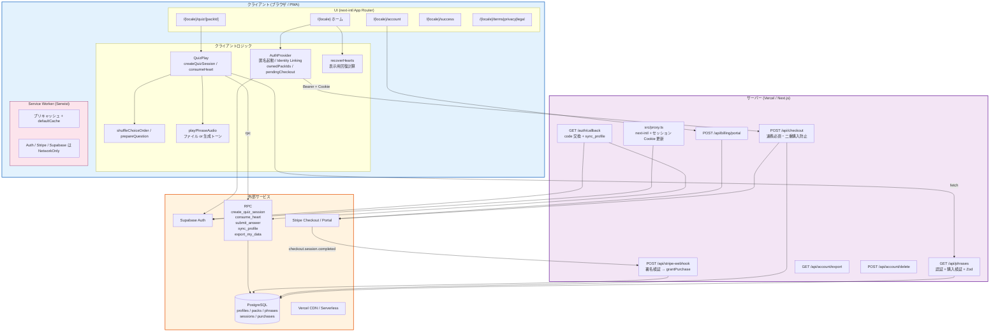
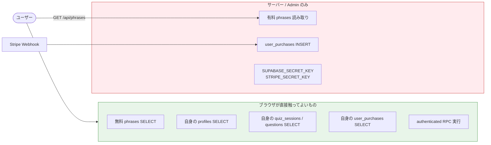
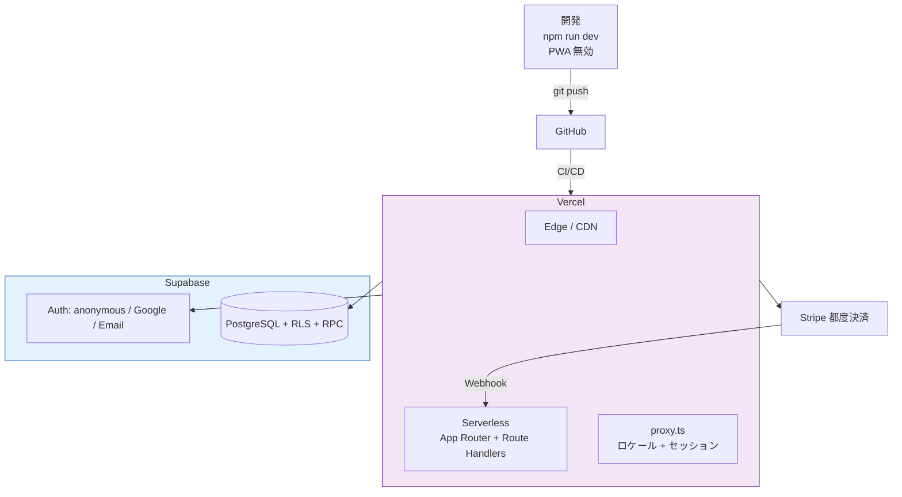

# 基本設計書：システム全体構造図（アーキテクチャ）

> **バージョン履歴**
> | バージョン | 日付 | 変更内容 |
> |---|---|---|
> | v1.0 | 2026-09-19 | 現行 Next.js 16 + Supabase RPC + Stripe 都度課金の as-is |

---

## 1. アーキテクチャ概要

Japanki は **Next.js App Router** をフロント兼 BFF とし、学習データと権限の正は **Supabase PostgreSQL + RLS + SECURITY DEFINER RPC** に置く。ブラウザは匿名セッションで起動し、教材の閲覧・ハート・購入判定をサーバー側で確定する。

| レイヤー | 役割 | 技術 |
|---|---|---|
| **プレゼンテーション** | ロケール付き UI・ルーティング | Next.js App Router / React 19 / Tailwind v4 / next-intl |
| **クライアント状態** | 認証・所有パック・保留 Checkout | `AuthProvider`（Context） |
| **ドメインロジック** | シャッフル、正誤、ハート表示、アクセス判定 | `src/lib/quiz/*`, `src/lib/hearts/*`, `src/lib/phrases/*`, `src/lib/billing/*` |
| **BFF (Route Handlers)** | 有料フレーズ配信・Checkout・Webhook・Portal | `src/app/api/*` |
| **データ / 権限** | ユーザー・教材・セッション・購入 | Supabase PostgreSQL + RPC + RLS |
| **認証** | 匿名 / Google / Email | Supabase Auth |
| **決済** | 都度購入の確定 | Stripe Checkout + Webhook |
| **オフライン** | 静的アセットキャッシュ | Serwist Service Worker（開発時無効） |

クライアントから `quiz_attempts` / `quiz_session_questions` / `user_purchases` への直接 INSERT は RLS で不可能。変更は RPC または Admin（Webhook）のみ。

---

## 2. コンポーネント構成図

---

## 3. データフロー（権限の境界）

**原則**

1. 教材の正本は DB。UI は `messages/*.json`。
2. 5 問の集合は RPC が INSERT した `quiz_session_questions` が正。クライアントは並べ替えて表示するだけ。
3. 正誤判定の正は `submit_answer`。ハート減算の正は `create_quiz_session` の開始成功時1回。UI の `recoverHearts` は表示用。
4. 購入の正は Webhook → `grantPurchase`。Success URL は案内のみ。

---

## 4. デプロイ構成図

ビルドは `next build --webpack`（`package.json` の `build`）。`next.config.ts` は next-intl プラグインと Serwist を合成する。

---

## 5. レイヤー責務一覧

| レイヤー | ファイル | 責務 |
|---|---|---|
| **ページ** | `src/app/[locale]/page.tsx` | ホーム。Survival / Travel CTA と購入ボタン |
| **ページ** | `src/app/[locale]/quiz/[packId]/page.tsx` | クイズシェル。本体は `QuizPlay` |
| **ページ** | `src/app/[locale]/account/page.tsx` | 購入一覧・Portal・エクスポート・退会 |
| **ページ** | `src/app/[locale]/success/page.tsx` | 決済後案内。purchase-status をポーリング。権限付与はしない |
| **ページ** | `src/app/[locale]/{terms,privacy,legal}/page.tsx` | 規約・プライバシー・特商法 |
| **Proxy** | `src/proxy.ts` | next-intl ルーティング + `attachSupabaseSession` |
| **API** | `GET /api/phrases` | 認証・購入・Zod 済みフレーズ返却（`correct_choice_index` 非含） |
| **API** | `POST /api/checkout` | Identity 検証、二重購入防止、Checkout Session |
| **API** | `POST /api/stripe-webhook` | 署名検証と `grantPurchase` |
| **API** | `POST /api/billing/portal` | Customer Portal Session |
| **API** | `GET /api/account/export` | セッション RPC `export_my_data` + `getUser` 識別子の JSON |
| **API** | `POST /api/account/delete` | `deleteUser`。Stripe Customer 削除は best-effort |
| **Auth CB** | `GET /auth/callback` | OAuth/OTP の code 交換。`sync_profile` を試行 |
| **Context** | `src/components/auth/AuthProvider.tsx` | 匿名 boot、連携モーダル、所有パック、自動 Checkout |
| **クイズ UI** | `src/components/quiz/QuizPlay.tsx` | セッション開始時に1ハート、出題、音声 |
| **RPC クライアント** | `src/lib/quiz/rpc-client.ts` | `create_quiz_session` / `consume_heart` / `submit_answer` |
| **出題** | `src/lib/quiz/build-queue.ts` 等 | 5問検証、シャッフル、正誤 |
| **課金** | `src/lib/billing/*` | ガード、所有判定、Webhook、Portal |
| **i18n** | `src/i18n/*`, `src/lib/i18n/locales.ts` | 9 UI 言語、8 教材言語 |
| **Supabase** | `src/lib/supabase/{client,server,admin,config,session-proxy}.ts` | Anon / Cookie / Secret の使い分け |
| **PWA** | `src/sw.ts`, `src/app/manifest.ts` | SW と Web Manifest |
| **定数** | `src/lib/constants/app.ts` | アプリ名・連絡先・パック ID |

---

## 6. Supabase クライアントの使い分け

| モジュール | 鍵 | 用途 |
|---|---|---|
| `client.ts` | Anon + ブラウザ | Auth 操作、RPC、自身の SELECT |
| `server.ts` | Anon + cookies | Route Handler / Server の `getUser` |
| `session-proxy.ts` | Anon + cookies | 全ページリクエストでセッション更新 |
| `admin.ts` | `SUPABASE_SECRET_KEY` | 有料 phrases 読み取り、購入 INSERT、Checkout 時のパック参照 |

Admin は Route Handler 内でのみ使用する。Client Component から import しない。
