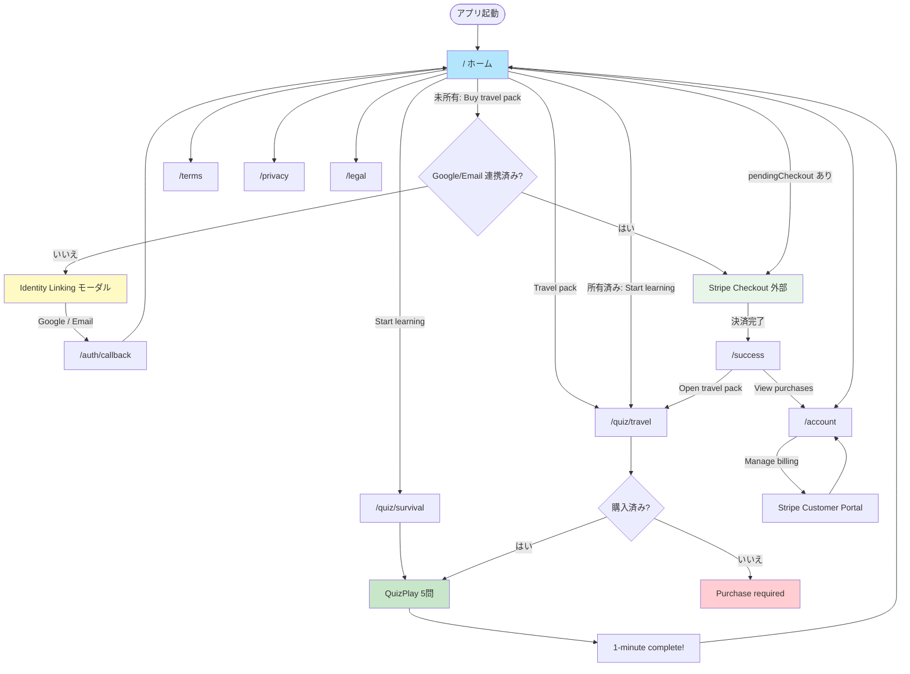
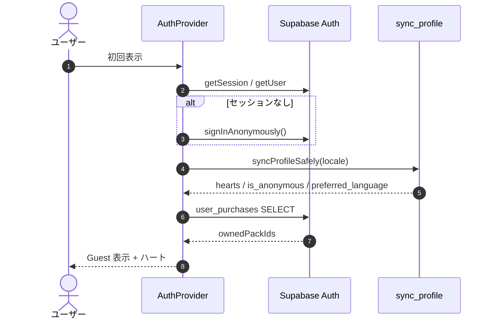
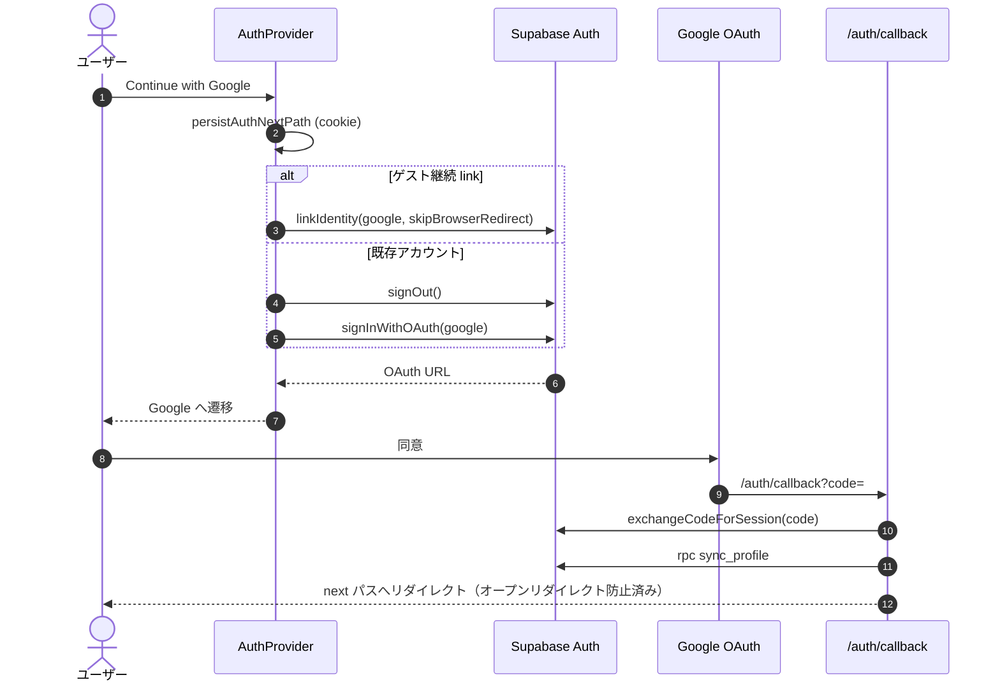
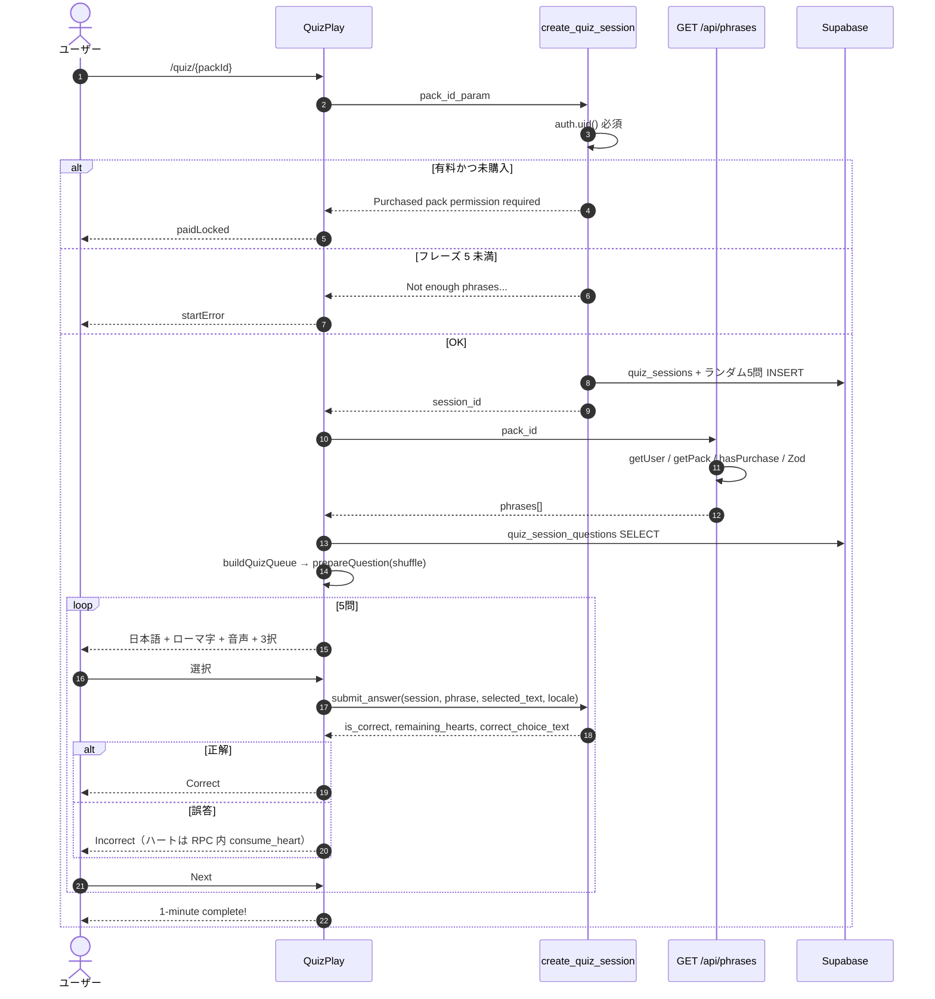
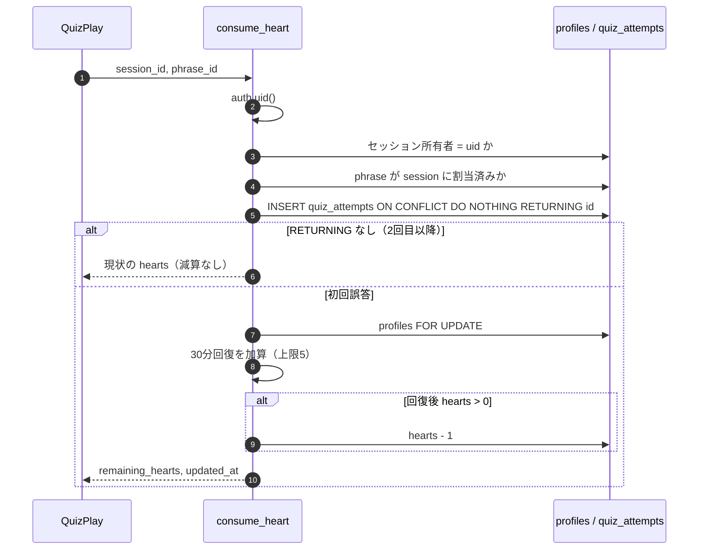
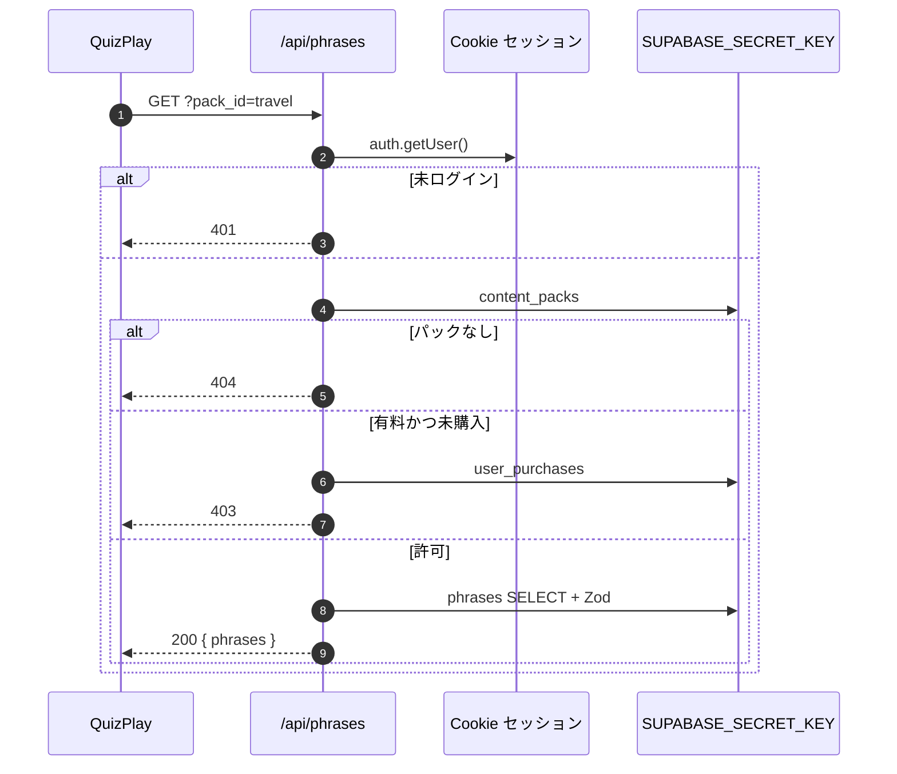
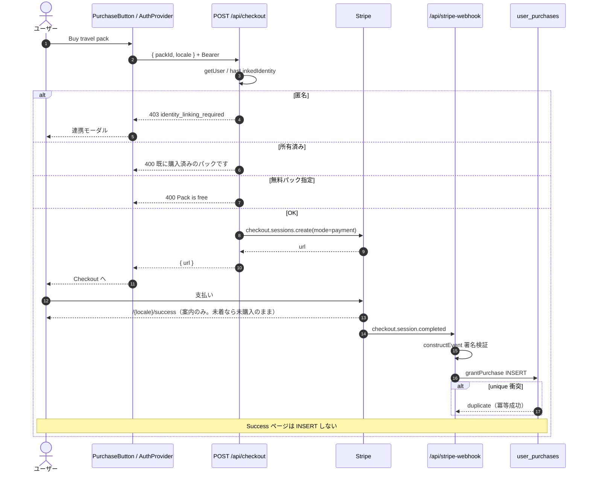
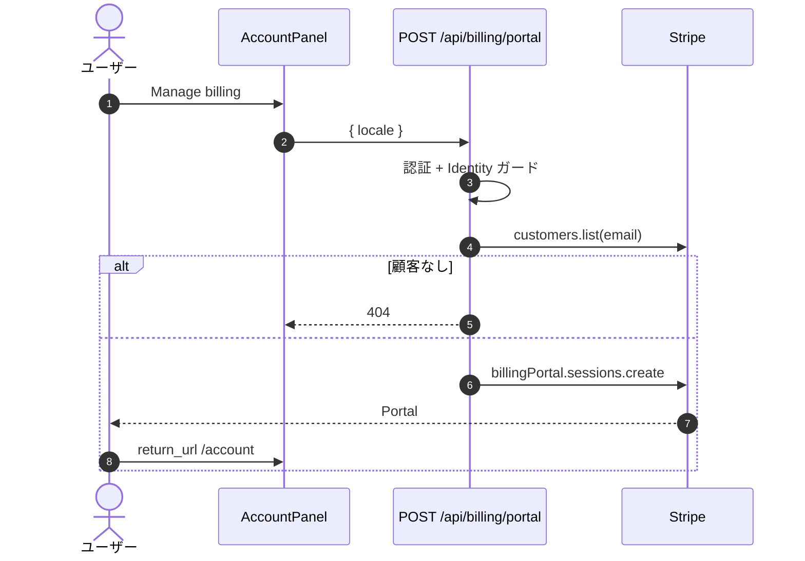

# 基本設計書：画面遷移図 ＆ 処理シーケンス図

> **バージョン履歴**
> | バージョン | 日付 | 変更内容 |
> |---|---|---|
> | v1.0 | 2026-09-19 | 現行ルート・認証・クイズ・Stripe フロー |

---

## 1. 画面遷移図（UIフロー）

ロケールプレフィックス `/{locale}` は省略して書く（例: `/en/quiz/survival`）。

### 主要ルート

| パス | 役割 |
|---|---|
| `/{locale}` | ホーム。無料開始・有料導線・購入/所有 CTA |
| `/{locale}/quiz/[packId]` | クイズ。`packId` は `survival` / `travel` |
| `/{locale}/success` | 決済完了案内。権限は付与しない |
| `/{locale}/account` | 所有パックと Portal |
| `/{locale}/terms` `/privacy` `/legal` | 法務 |
| `/auth/callback` | ロケール外。OAuth/OTP コールバック |
| `/api/*` | BFF。Proxy matcher から除外 |

---

## 2. 匿名起動と Identity Linking

### 2-1. 起動時匿名セッション

### 2-2. Google 連携（ゲスト継続 vs 既存アカウント）

Identity 衝突時は `mapAuthError` が `identity_collision` を返し、自動マージせず既存ログインを案内する。

### 2-3. Email

- **ゲスト継続**: `updateUser({ email })` → 確認メール。
- **既存ログイン**: 匿名を `signOut` した上で `signInWithOtp`。

---

## 3. クイズ開始〜5問完了

`buildQuizQueue` は assigned がちょうど 5 件のユニーク ID であること、各フレーズが同一 `packId` に属することを検証する。

---

## 4. ハート減算（アトミック）

クライアントの `recoverHearts` はヘッダー表示用であり、減算の正本ではない。

---

## 5. 有料フレーズ取得

無料パックでも API は認証を要求する。クライアント RLS でも無料 phrases は読めるが、クイズ UI は常に API 経由で揃える。

---

## 6. Stripe 都度購入

連携後の自動 Checkout は `pendingCheckoutPackId`（URL `?checkout=` または `japanki_pending_checkout_pack`）を `AuthProvider` が見つけ、非匿名かつ未所有なら `triggerCheckout` する。

---

## 7. Customer Portal

