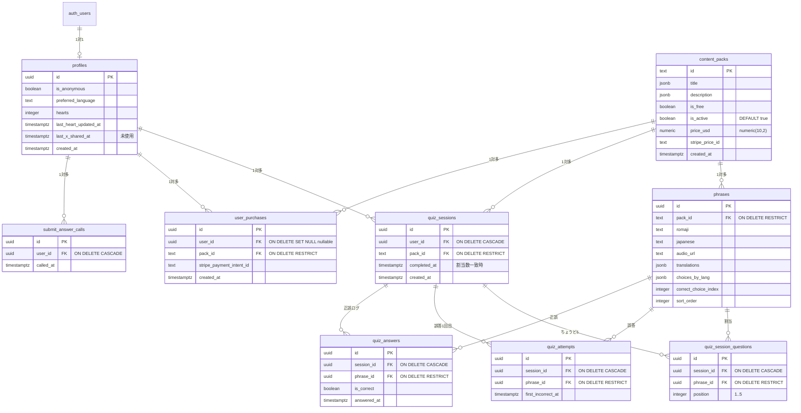

# 基本設計書：データストア詳細スキーマ設計

> **バージョン履歴**
> | バージョン | 日付 | 変更内容 |
> |---|---|---|
> | v1.0 | 2026-09-19 | `supabase/migrations/001`〜`003` の as-is |
> | v1.1 | 2026-09-20 | Issue #25: パック/フレーズ FK を ON DELETE RESTRICT に明示 (`005`) |
> | v1.2 | 2026-09-20 | Issue #24 / #37: `price_usd` を numeric(10,2) に拡張し `is_active` を追加 (`006`) |
> | v1.3 | 2026-09-20 | Issue #42: `is_active=false` を一時非表示に変更（既存購入者は継続プレイ可、`008`） |
> | v1.4 | 2026-09-21 | Issue #17: `create_quiz_session` を同一 user 20回/時に制限（`009`） |
> | v1.5 | 2026-09-21 | Issue #17 follow-up: `submit_answer` を `submit_answer_calls` COUNT で 60回/時に制限（`010`） |
> | v1.6 | 2026-09-21 | Issue #15: `quiz_answers` と割当数一致時の `completed_at` 更新（`011`） |
| v1.7 | 2026-09-21 | Issue #20: `user_purchases.user_id` を SET NULL、`export_my_data`（`012`） |

マイグレーション適用順:

1. `001_init.sql` — テーブル、インデックス、RPC（`create_quiz_session`, `consume_heart`）、RLS
2. `002_sync_profile.sql` — `sync_profile`（Identity 連携後のプロファイル同期）
3. `003_seed_packs.sql` — Survival / Travel と各 5 フレーズ
4. `004_submit_answer_and_billing_guards.sql` — `submit_answer` RPC と購入履歴の保護
5. `005_fk_on_delete_policy.sql` — パック/フレーズ参照 FK を ON DELETE RESTRICT に付け替え
6. `006_content_packs_price_and_active.sql` — `price_usd` numeric(10,2) と論理削除 `is_active`
7. `007_diversify_seed_correct_index.sql` — シードの `correct_choice_index` を 0/1/2 に分散（Issue #16）
8. `008_inactive_pack_purchased_play.sql` — `is_active=false` でも購入済みは `create_quiz_session` 可（Issue #42）
9. `009_quiz_start_rate_limit.sql` — `quiz_sessions(user_id, created_at)` インデックスと `create_quiz_session` の 20回/時制限（Issue #17）
10. `010_submit_answer_rate_limit.sql` — `submit_answer_calls` と `submit_answer` の 60回/時制限（Issue #17 follow-up）
11. `011_quiz_session_completion.sql` — `quiz_answers` と割当数一致時の `completed_at` 更新（Issue #15）
12. `012_gdpr_account_deletion.sql` — `user_purchases.user_id` を NULL 可 + ON DELETE SET NULL、`export_my_data`（Issue #20）

---

## 1. データストア概要

| ストア | 技術 | 用途 |
|---|---|---|
| **Supabase PostgreSQL** | クラウド DB | ユーザー、教材、クイズセッション、購入。正本 |
| **ブラウザ Cookie** | Supabase SSR | Auth セッション |
| **sessionStorage / localStorage** | `japanki_pending_checkout_pack` | 連携前の購入パック（JSON + TTL 10分） |
| **Cookie** | `japanki_auth_next` | OAuth 復帰先パス（10分、相対パスのみ） |

学習進捗のローカル DB は持たない。未設定環境では匿名サインインをスキップし、クイズは `notConfigured` を出す。

---

## 2. ER図

---

## 3. テーブル定義

### 3-1. `profiles`

`auth.users` INSERT 時に `handle_new_user` が 1 行作成する（ハート 5、`is_anonymous` は provider が anonymous なら true）。

| カラム | 型 | 制約 | 説明 |
|---|---|---|---|
| `id` | uuid | PK, FK → auth.users ON DELETE CASCADE | Auth ユーザーと同一 |
| `is_anonymous` | boolean | default true | Identity 未連携 |
| `preferred_language` | text | default `en` | UI ロケール |
| `hearts` | integer | 0〜5 | ハート残数 |
| `last_heart_updated_at` | timestamptz | | 減算・回復計算の基準時刻 |
| `last_x_shared_at` | timestamptz | nullable | 将来の X シェア回復用。アプリ未使用 |
| `created_at` | timestamptz | | 作成日時 |

クライアントは SELECT のみ（自分の行）。更新は `sync_profile` / `create_quiz_session`（開始時の1減算）/ 正答時の回復書き戻し。

### 3-2. `content_packs`

| カラム | 型 | 説明 |
|---|---|---|
| `id` | text PK | `survival` / `travel` |
| `title` / `description` | jsonb | 8 言語キー |
| `is_free` | boolean | 無料判定 |
| `is_active` | boolean NOT NULL DEFAULT true | 一時非表示フラグ（既存購入者は継続プレイ可）。Issue #37 / #42。false でカタログと新規購入から除外 |
| `price_usd` | numeric(10,2) | Checkout の `price_data` に使用（stripe_price_id が無い場合）。Issue #24 で (4,2) から拡張 |
| `stripe_price_id` | text | 設定時は Stripe Price を優先 |

SELECT は全員可（購入履歴のタイトル表示のため非アクティブ行も読める）。パックの物理削除は子テーブル FK が RESTRICT のため拒否される。`is_active = false` は一時非表示（コンテンツ更新中など）。無料パックと未購入ユーザーは not found。有料の既存購入者はプレイ継続可（Issue #42 / `008`）。新規 Checkout は非表示中も 404 のまま。

### 3-3. `phrases`

| カラム | 型 | 説明 |
|---|---|---|
| `id` | uuid | シードは固定 UUID |
| `pack_id` | text FK → content_packs ON DELETE RESTRICT | 所属パック。パック物理削除は拒否 |
| `romaji` / `japanese` | text | 出題表示 |
| `audio_url` | text | 例: `/audio/arigatou.mp3` |
| `translations` | jsonb | 8 言語の訳 |
| `choices_by_lang` | jsonb | 8 言語 × 3 択 |
| `correct_choice_index` | integer | 0〜2。シードはパック内で 0/1/2 に分散（`007`、Issue #16） |
| `sort_order` | integer | API 取得時の並び。セッション内順は `position` |

クライアント SELECT は **無料パックのみ**。有料は `/api/phrases` + Admin。

Zod（`PhraseRecordSchema`）は教材検証用に 8 言語キーと 3 択タプル、UUID、`correct_choice_index` 0〜2 を検証する。公開 API は `PublicPhraseRecordSchema` により `correct_choice_index` を出力しない。`ja` キーは教材に存在しない。

### 3-4. `quiz_sessions`

ユーザーとパックに紐づく 1 プレイ。`completed_at` は `submit_answer` が `quiz_answers` 件数と `quiz_session_questions` 件数を比較し、割当すべてに解答済みかつ `completed_at` が null のときだけ now() を書く（Issue #15 / `011`）。出題数の 5 は決め打ちしない。`user_id` は profiles ON DELETE CASCADE、`pack_id` は content_packs ON DELETE RESTRICT。

### 3-5. `quiz_session_questions`

| 制約 | 意味 |
|---|---|
| `position` BETWEEN 1 AND 5 | スロット |
| UNIQUE (`session_id`, `position`) | 同一位置に 2 問置かない |
| UNIQUE (`session_id`, `phrase_id`) | 同一セッションで同一 phrase を重複割当しない |

クライアント INSERT 不可。SELECT は自分のセッションのみ（QuizPlay が順序取得に使用）。`session_id` は quiz_sessions ON DELETE CASCADE、`phrase_id` は phrases ON DELETE RESTRICT（出題済みフレーズの物理削除を拒否し履歴を保持）。

### 3-6. `quiz_attempts`

同一 (`session_id`, `phrase_id`) は 1 行。初期実装では初回誤答の記録だった。Issue #52 以降、開始時のハート消費は `quiz_attempts` を使わない。SELECT ポリシーなし（クライアントは読めない）。`session_id` は quiz_sessions ON DELETE CASCADE、`phrase_id` は phrases ON DELETE RESTRICT。

| 制約 | 意味 |
|---|---|
| UNIQUE (`session_id`, `phrase_id`) `quiz_attempts_session_id_phrase_id_key` | 同一セッション・同一問題の attempt 行は1つ。ハート消費の判定には使わない（Issue #52） |

### 3-7. `user_purchases`

UNIQUE (`user_id`, `pack_id`) が Webhook 再送の冪等キー（PostgreSQL は NULL 同士を重複と見なさない）。SELECT は本人のみ。INSERT は Admin の `grantPurchase` のみ（エラーコード `23505` は duplicate として成功扱い）。`stripe_payment_intent_id` で返金時の行特定を行う（Issue #20 でもハッシュしない）。`user_id` は NULL 可・profiles ON DELETE SET NULL（退会後も税務・返金用に行を残す、`012`）。`pack_id` は content_packs ON DELETE RESTRICT（購入履歴をパック削除から守る）。

### 3-8. `submit_answer_calls`

`submit_answer` の hourly レート制限用ログ。クライアントポリシーなし（RPC の SECURITY DEFINER のみが INSERT）。`user_id` は profiles ON DELETE CASCADE。1時間より古い行は既存 Vercel Cron（`/api/internal/cleanup-anonymous-users`）が削除する。

| カラム | 型 | 制約 | 説明 |
|---|---|---|
| `id` | uuid | PK | |
| `user_id` | uuid | FK → profiles ON DELETE CASCADE | 呼び出しユーザー |
| `called_at` | timestamptz | default now() | 呼び出し時刻 |

### 3-9. `quiz_answers`

正誤ログ（分析用）。ハート消費とは独立。同一 (`session_id`, `phrase_id`) は 1 行。`Invalid choice` など判定前例外では INSERT しない。SELECT ポリシーなし。`session_id` は quiz_sessions ON DELETE CASCADE、`phrase_id` は phrases ON DELETE RESTRICT。分析用ビューは作らない（ダッシュボード未実装。集計は `quiz_answers` + `quiz_sessions` から後で組める）。

| カラム | 型 | 制約 | 説明 |
|---|---|---|
| `id` | uuid | PK | |
| `session_id` | uuid | FK → quiz_sessions ON DELETE CASCADE | |
| `phrase_id` | uuid | FK → phrases ON DELETE RESTRICT | |
| `is_correct` | boolean | not null | その問題の正誤 |
| `answered_at` | timestamptz | default now() | 初回記録時刻 |

| 制約 | 意味 |
|---|---|
| UNIQUE (`session_id`, `phrase_id`) `quiz_answers_session_id_phrase_id_key` | 再提出は `ON CONFLICT DO NOTHING` |

### 3-10. FK ON DELETE 方針（Issue #25）

`001_init.sql` ではパック/フレーズ参照が `ON DELETE CASCADE` だった。`005_fk_on_delete_policy.sql` で以下を `RESTRICT` に付け替える。パックのカタログ非表示は物理 DELETE せず、`content_packs.is_active`（Issue #37 / #42）で一時非表示にする。既存購入者のプレイは `008` で継続できる。

| FK | 参照先 | ON DELETE | 理由 |
|---|---|---|---|
| `phrases.pack_id` | `content_packs.id` | RESTRICT | パック誤削除で教材が一括消失する事故を防ぐ |
| `quiz_sessions.pack_id` | `content_packs.id` | RESTRICT | プレイ履歴をパック削除から守る |
| `user_purchases.pack_id` | `content_packs.id` | RESTRICT | 購入履歴をパック削除から守る |
| `quiz_session_questions.phrase_id` | `phrases.id` | RESTRICT | 出題割当履歴を保持する |
| `quiz_attempts.phrase_id` | `phrases.id` | RESTRICT | ハート減算履歴を保持する |
| `quiz_answers.phrase_id` | `phrases.id` | RESTRICT | 正誤ログをフレーズ削除から守る |
| `profiles.id` | `auth.users.id` | CASCADE | 既存。Auth 削除に追随 |
| `quiz_sessions.user_id` / `submit_answer_calls.user_id` | profiles | CASCADE | ユーザー削除時に学習データとレート制限ログを削除 |
| `user_purchases.user_id` | profiles | SET NULL | Issue #20。退会後も購入行を税務・返金用に残す |
| `*.session_id` | quiz_sessions | CASCADE | セッション削除時の子行掃除 |

---

## 4. インデックス

`001_init.sql` で作成:

- `idx_phrases_pack_id`
- `idx_quiz_sessions_user_id` / `idx_quiz_sessions_pack_id` / `idx_quiz_sessions_user_id_created_at`（009、時間窓の COUNT 用）
- `idx_quiz_session_questions_session_id` / `idx_quiz_session_questions_phrase_id`
- `idx_quiz_attempts_session_id` / `idx_quiz_attempts_phrase_id`
- `idx_user_purchases_user_id` / `idx_user_purchases_pack_id`
- `idx_submit_answer_calls_user_id_called_at`（010、時間窓の COUNT 用）
- `idx_quiz_answers_session_id`（011）

複合 UNIQUE は制約側でインデックス済み。

---

## 5. RPC

実行権限はすべて `authenticated` のみ（`public` から REVOKE）。`SECURITY DEFINER` + `search_path = public`。内部で必ず `auth.uid()` を使う。

### 5-1. `create_quiz_session(pack_id_param text)`

戻り: `session_id uuid`

1. 未認証 → `Not authenticated`
2. パックなし、無料で `is_active = false`、または有料・非アクティブで未購入 → `Content pack not found`
3. 有料かつアクティブで未購入 → `Purchased pack permission required`（有料・非アクティブで購入済みなら例外で作成可）
4. 直近1時間の同一 `user_id` の `quiz_sessions` が 20 件以上 → `Rate limit exceeded`（`QUIZ_START_RATE_LIMIT_PER_HOUR`）
5. `profiles` を `FOR UPDATE` し、経過分を 30 分単位で回復（上限 5）。回復後が 0 なら `No hearts remaining`（セッション未作成）
6. セッション INSERT
7. `order by random() limit 5` で questions INSERT
8. 5 問に満たなければ例外（トランザクションロールバック。ハートは減らない）
9. 5 問確定後に `hearts` を 1 減算し、回復調整済みの `last_heart_updated_at` を書く（Issue #52）

### 5-2. `consume_heart(session_id_param uuid, phrase_id_param uuid)`

戻り: `remaining_hearts`, `updated_at`

Issue #52 以降は減算しない。未認証なら `Not authenticated`。認証済みなら本人の `profiles.hearts` と `last_heart_updated_at` を返す。`quiz_attempts` への INSERT と `profiles` の UPDATE は行わない。

### 5-3. `submit_answer(session_id_param uuid, phrase_id_param uuid, selected_choice_text text, locale_param text default 'en')`

戻り: `is_correct`, `remaining_hearts`, `updated_at`, `correct_choice_text`

1. 未認証 / 他人セッション / 未割当 phrase は例外
2. 直近1時間の同一 `user_id` の `submit_answer_calls` が 60 件以上 → `Rate limit exceeded`（`SUBMIT_ANSWER_RATE_LIMIT_PER_HOUR`。`create_quiz_session` と同じ例外文言）
3. `choices_by_lang[locale][correct_choice_index]` と選択テキストを比較（`ja` は `en`）
4. 正誤ではハートを減算しない。誤答は保存値を返す。正答で未反映の自然回復があれば `profiles` に書き戻す（`013`）
5. 有効な選択肢の判定後、`quiz_answers` へ INSERT ON CONFLICT DO NOTHING。行数が `quiz_session_questions` 件数と一致し `completed_at` が null なら now() を書く。`Invalid choice` では記録しない
6. 正誤に関わらず `submit_answer_calls` へ 1 行 INSERT
7. 正答・誤答とも `correct_choice_text` を返す。BFF は `Rate limit exceeded` を 429、`Invalid choice` を 409 `invalid_choice` に写像する。残り 0 でも採点する

### 5-4. `sync_profile(p_preferred_language text default null)`

`002_sync_profile.sql`。カラム曖昧性対策として `#variable_conflict use_column`、テーブル別名、`on conflict on constraint profiles_pkey` を使用。

- `auth.identities` に anonymous 以外があれば `is_anonymous = false`
- 言語は引数優先、なければ既存、なければ `en`
- INSERT or UPDATE（ハートは新規行のみ 5。既存行の hearts は上書きしない）

クライアントは引数不一致時に `p_preferred_language` → `preferred_language_param` → 引数なし、の順でリトライする。

### 5-5. `export_my_data()`

`012_gdpr_account_deletion.sql`。引数なし。`auth.uid()` が null なら `Not authenticated`。本人の `profiles` / `user_purchases` / `quiz_sessions`（questions・answers・attempts を入れ子）を jsonb で返す。`submit_answer_calls` と教材マスタは含めない。`quiz_answers` はクライアント SELECT 不可のため、この SECURITY DEFINER 経由のみ。BFF `GET /api/account/export` がセッションの `getUser()` 識別子を足して JSON ダウンロードする。service_role での全件取得はしない。

---

## 6. RLS 方針

**INSERT / UPDATE / DELETE ポリシーは意図的に作らない。**

| テーブル | SELECT |
|---|---|
| `content_packs` | 全員（非アクティブ含む。購入履歴表示のため） |
| `phrases` | `is_free = true AND is_active = true` のパックのみ |
| `profiles` | `auth.uid() = id` |
| `quiz_sessions` | `auth.uid() = user_id` |
| `quiz_session_questions` | 自分のセッション経由 |
| `user_purchases` | `auth.uid() = user_id` |
| `quiz_attempts` | ポリシーなし（読めない） |
| `quiz_answers` | ポリシーなし（読めない）。authenticated からも REVOKE。本人分は `export_my_data` のみ |
| `submit_answer_calls` | ポリシーなし（読めない）。authenticated からも REVOKE。エクスポート対象外 |

---

## 7. シード教材

Survival（無料）: ありがとう / すみません / 水をください / はい / トイレはどこですか  

Travel（有料 USD 2.99）: いくらですか / 駅はどこですか / おいしい / 助けて / 英語が話せますか  

各 `choices_by_lang` は 8 言語とも 3 要素。`correct_choice_index` はパック内で 0,1,2,0,1。各言語配列のその位置が `translations` と一致する。音声パスは `/audio/*.mp3`（ファイル未配置時はクライアントが生成トーン）。

---

## 8. ブラウザ側の一時ストア

| キー | 場所 | 用途 |
|---|---|---|
| `japanki_pending_checkout_pack` | sessionStorage + localStorage（JSON `{packId, storedAt}`、TTL 10分） | 連携後の購入確認。Issue #18 |
| `japanki_auth_next` | Cookie（Max-Age 600, SameSite=Lax） | OAuth 復帰パス。`safeNextPath` で `/` 始まりかつ `//` 禁止 |
| URL `?checkout=` / `?checkout_pack=` | Query | 復帰時のパック指定 |
| URL `?authError=` | Query | 認証エラー表示 |
