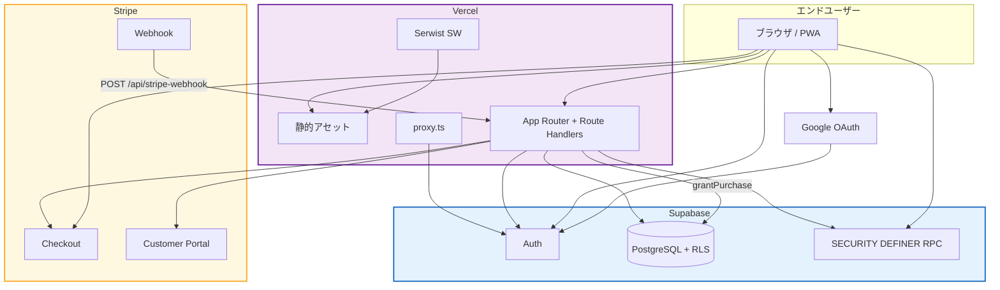
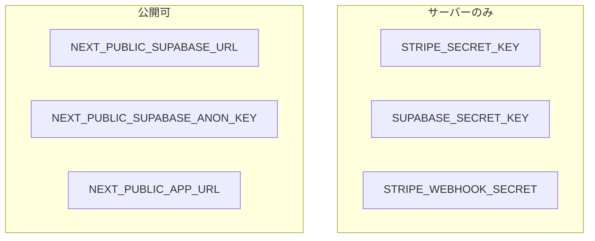

# サービスアーキテクチャ設計書：外部サービス連携

> **作成日**: 2026-09-19  
> **対象**: 現行実装（Next.js 16 PWA + Supabase + Stripe 都度課金）

---

## 1. 利用サービス一覧

| サービス | 種別 | 用途 | 課金モデル |
|---|---|---|---|
| **Vercel** | PaaS | ホスティング、Serverless、CDN | Hobby / Pro |
| **Supabase** | BaaS | Auth（匿名/Google/Email）、PostgreSQL、RPC、RLS | Free / Pro |
| **Stripe** | 決済 | Checkout 都度決済、Webhook、Customer Portal | 手数料 |
| **Google Identity** | IdP | Google OAuth（Supabase プロバイダー経由） | 無料枠 |

Gemini 等の生成 AI API は使わない。音声欠落時のフォールバックはブラウザ Web Audio。

---

## 2. 全体連携

---

## 3. サービス別詳細

### 3-1. Vercel

- Framework: Next.js。`build` は `next build --webpack`。
- Route Handlers が BFF。`/api/stripe-webhook` は raw body で署名検証するため `request.text()` を使う。
- 環境変数は Vercel プロジェクト設定。`NEXT_PUBLIC_*` のみクライアント埋め込み。

### 3-2. Supabase Auth

| 方式 | API | 用途 |
|---|---|---|
| Anonymous | `signInAnonymously` | ゲスト学習 |
| Google | `linkIdentity` / `signInWithOAuth` | 進捗保存・購入 |
| Email | `updateUser({email})` / `signInWithOtp` | 同上 |

コールバックは常に `{origin}/auth/callback`。`next` は Cookie `japanki_auth_next` または query。`safeNextPath` がオープンリダイレクトを防ぐ。

セッションは `@supabase/ssr` の Cookie。Proxy がページリクエストごとに `getUser()` して更新する。Checkout は Cookie に加え `Authorization: Bearer` を送り、OAuth 直後のラグで 401 しないようにする。

### 3-3. Stripe

**モードは `payment`（都度）。サブスクリプションではない。**

Checkout Session:

- `client_reference_id`: Supabase user id
- `metadata.supabase_user_id` / `metadata.pack_id`
- `success_url`: `/{locale}/success?pack=`
- `cancel_url`: `/{locale}`
- 価格: `stripe_price_id` があれば Price、なければ `price_data`（USD cents from `price_usd`）

Webhook は署名検証後に次を処理する。署名失敗は 400。metadata 欠落は 400。Success URL からの購入付与は行わない。

- `checkout.session.completed` / `checkout.session.async_payment_succeeded`: `payment_status === "paid"` のときのみ `grantPurchase`（`stripe_payment_intent_id` を保存）
- `payment_status !== "paid"`（非同期決済の unpaid）: 付与せず 200
- `charge.refunded`: `payment_intent` で `user_purchases` を削除しアクセス権を剥奪
- その他イベント: 200 で無視

Portal はメールで Customer を 1 件引き、`return_url` を `/{locale}/account` にする。

### 3-4. PWA（Serwist）

| 項目 | 値 |
|---|---|
| `swSrc` | `src/sw.ts` |
| `swDest` | `public/sw.js` |
| 開発 | `disable: NODE_ENV === "development"` |
| バイパス | `*.supabase.co`, `*.stripe.com`, Google OAuth, `/auth/` |

Manifest: standalone、背景 `#14110e`、テーマ `#e23d28`、アイコン `/icon-192.png` と `/icon-512.png`。

---

## 4. セキュリティ設計

### 4-1. シークレット配置

`src/lib/security/client-secrets.test.ts` が Client 側への秘密鍵混入を検査する。

### 4-2. 認可

| 対象 | 制御 |
|---|---|
| テーブル変更 | RLS で INSERT/UPDATE/DELETE ポリシーなし + RPC `auth.uid()` |
| 有料 phrases | RLS 遮断 + `/api/phrases` で購入確認 |
| Checkout | 連携済み Identity 必須、所有済みは 400、付与は Webhook のみ |
| Webhook | `constructEvent` 署名 |
| 認証 next | 相対パスのみ |

### 4-3. Identity 衝突

他ユーザーに既にある Google/Email へ link した場合、マージしない。ゲスト進捗は捨てて既存アカウントへログインする案内のみ（Human Gate 対象）。

---

## 5. 環境

| 環境 | URL | 特徴 |
|---|---|---|
| 開発 | `http://localhost:3000` | PWA 無効。Stripe は `stripe listen --forward-to localhost:3000/api/stripe-webhook` |
| 本番 | `NEXT_PUBLIC_APP_URL` | PWA 有効。Webhook 本番 endpoint |

---

## 6. 将来考慮（未実装）

| 項目 | 現状 | 候補 |
|---|---|---|
| 音声アセット | URL のみ。ファイル未配置 | `public/audio/` または Storage |
| X シェア回復 | `last_x_shared_at` のみ | シェア成功でハート回復 |
| セッション完了記録 | `completed_at` 未更新 | 5 問後に UPDATE（RPC 推奨） |
| オフライン出題 | 不可 | 無料パックの Precache（有料は不可） |
| 追加パック | 2 パックのみ | `content_packs` 行追加 + シード Zod レビュー |
| サブスク | 都度 2.99 USD | 現状スコープ外 |
