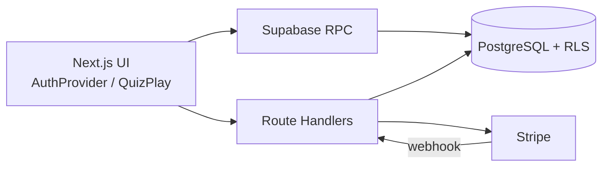

# Japanki 設計書 一式

> 個別設計書（`1_requirements.md` ～ `6_service_architecture.md`）の統合要約。詳細は各ファイルを正とする。  
> **バージョン**: v1.0（as-is）  
> **最終更新**: 2026-09-19  
> **as-is 正本**: コードとマイグレーション（本ディレクトリがその解説）  
> **プロダクト意図**: [`PRD.md`](../../PRD.md) v3.2 / 開発ルール: [`AGENTS.md`](../../AGENTS.md)

---

## 目次

1. [要件定義](#1-要件定義)
2. [システムアーキテクチャ](#2-システムアーキテクチャ)
3. [画面遷移・シーケンス](#3-画面遷移シーケンス)
4. [データスキーマ](#4-データスキーマ)
5. [ディレクトリ構成](#5-ディレクトリ構成)
6. [外部サービス](#6-外部サービス)

---

## 1. 要件定義

詳細: [`1_requirements.md`](./1_requirements.md)

Japanki は海外ライト層向けの **1セッション＝5問≒1分** の日本語学習 PWA。耳と3択で覚える。教材は 8 言語、UI は 8 言語 + `ja`。

| パック | ID | 価格 | 問題数 |
|---|---|---|---|
| Survival | `survival` | 無料 | 5 |
| Travel | `travel` | USD 2.99 都度 | 5 |

**守る原則**

- 5 問はサーバー RPC が確定する（クライアント抽選しない）
- ハート減算は `consume_heart` の `RETURNING` 判定（同一問題の再誤答は減らない）
- 有料 phrases は RLS 遮断。`/api/phrases` が認証と購入を見て返す
- 購入 INSERT は Stripe Webhook のみ。Success URL では付与しない
- 匿名のまま Checkout しない。Identity 衝突はマージしない
- UI で `ja` を選んでも訳と 3 択は英語

**実装と PRD の差**: PWA は Serwist。Stripe は都度決済。`ja` は UI のみ。音声ファイルは未配置で生成トーンへフォールバック。Webhook 遅延中の `/success` → クイズは未購入になり得る。

---

## 2. システムアーキテクチャ

詳細: [`2_architecture.md`](./2_architecture.md)



| 層 | 正本 |
|---|---|
| 出題集合 | `quiz_session_questions`（RPC INSERT） |
| ハート | `consume_heart` |
| 購入 | `user_purchases`（Webhook INSERT） |
| 画面文言 | `messages/*.json` |
| 問題訳 | `phrases` JSON + Zod |

---

## 3. 画面遷移・シーケンス

詳細: [`3_sequence_and_flow.md`](./3_sequence_and_flow.md)

```
起動 → 匿名セッション
  ├─ Survival クイズ（無料）
  ├─ Travel クイズ（購入必須）
  ├─ 購入 → Identity Linking → Stripe Checkout → /success（権限は Webhook）
  └─ /account → Customer Portal
```

クイズ: `create_quiz_session` → `/api/phrases`（`correct_choice_index` 非返却） → 割当 SELECT → `shuffleChoiceOrder` → `submit_answer` → 5 問完了演出。

---

## 4. データスキーマ

詳細: [`4_db_schema.md`](./4_db_schema.md)

テーブル: `profiles`, `content_packs`, `phrases`, `quiz_sessions`, `quiz_session_questions`, `quiz_attempts`, `user_purchases`

RPC: `create_quiz_session`, `consume_heart`, `submit_answer`, `sync_profile`

RLS: SELECT のみ。変更は RPC / Admin。`quiz_attempts` は SELECT ポリシーなし。

未使用カラム: `profiles.last_x_shared_at`, `quiz_sessions.completed_at`

---

## 5. ディレクトリ構成

詳細: [`5_ディレクトリ構成.md`](./5_ディレクトリ構成.md)

- アプリ本体: `src/`
- UI 翻訳: `messages/`
- DDL: `supabase/migrations/`
- 設計: `docs/design/`
- 検証: `npm run verify` / `npm run build`

---

## 6. 外部サービス

詳細: [`6_service_architecture.md`](./6_service_architecture.md)

| サービス | 役割 |
|---|---|
| Vercel | ホスティング |
| Supabase | Auth / DB / RPC |
| Stripe | 都度 Checkout + Webhook + Portal |
| Serwist | 本番 PWA。Auth/決済系はキャッシュしない |

秘密鍵: `SUPABASE_SECRET_KEY`, `STRIPE_SECRET_KEY`, `STRIPE_WEBHOOK_SECRET` はサーバーのみ。

---

## 関連 Issue 記録

| 文書 | 内容 |
|---|---|
| [`docs/issues/issue-013-sql-ambiguous-id.md`](../issues/issue-013-sql-ambiguous-id.md) | `sync_profile` の `id` 曖昧性（42702）と Checkout 403 |
| [`docs/issues/issue-016-double-purchase-prevention.md`](../issues/issue-016-double-purchase-prevention.md) | 所有表示と二重 Checkout 防止 |
| [`docs/issues/issue-oauth-authcontext-stripe-redirect.md`](../issues/issue-oauth-authcontext-stripe-redirect.md) | OAuth 後の AuthContext 同期と自動 Checkout |
